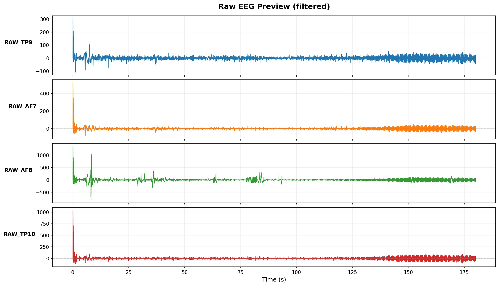
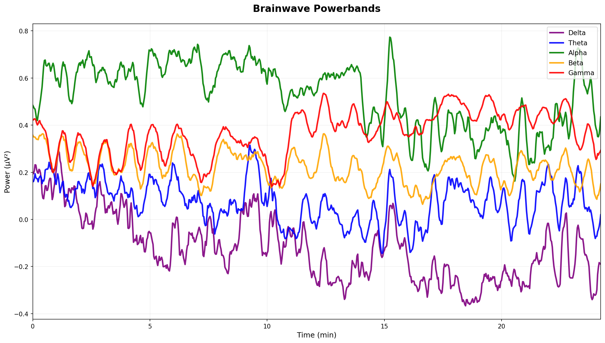
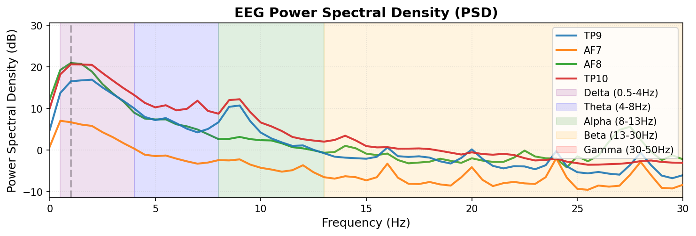
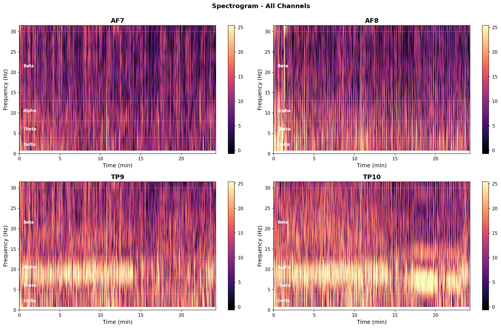
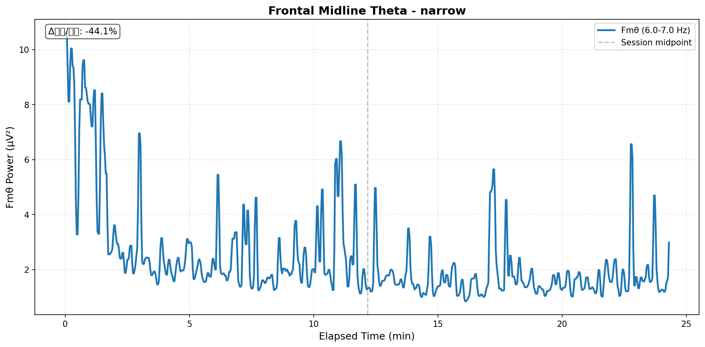
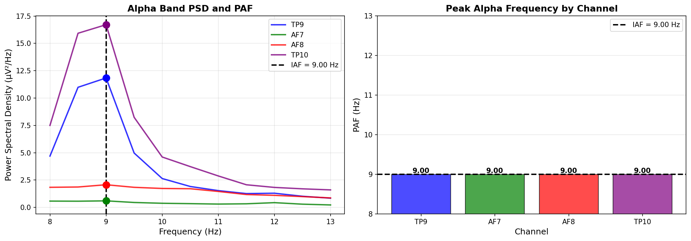
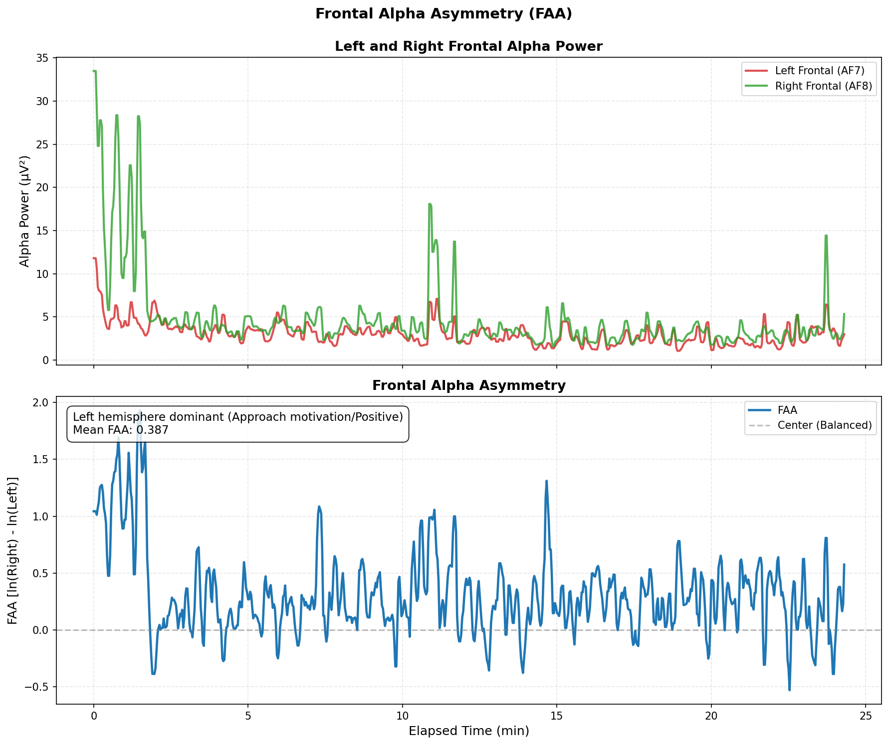
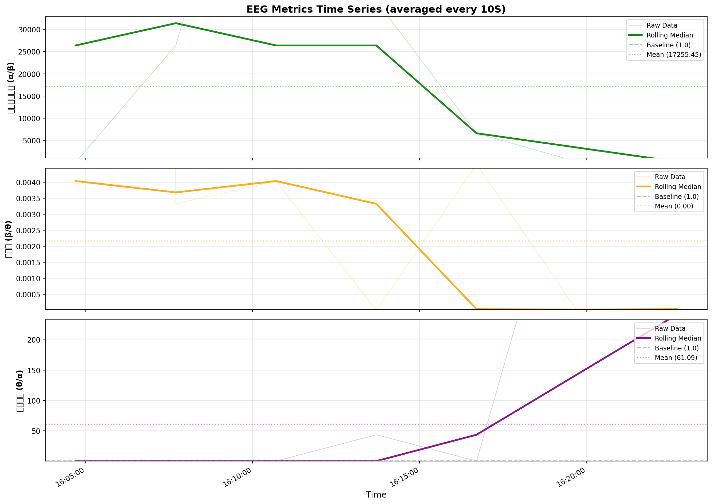
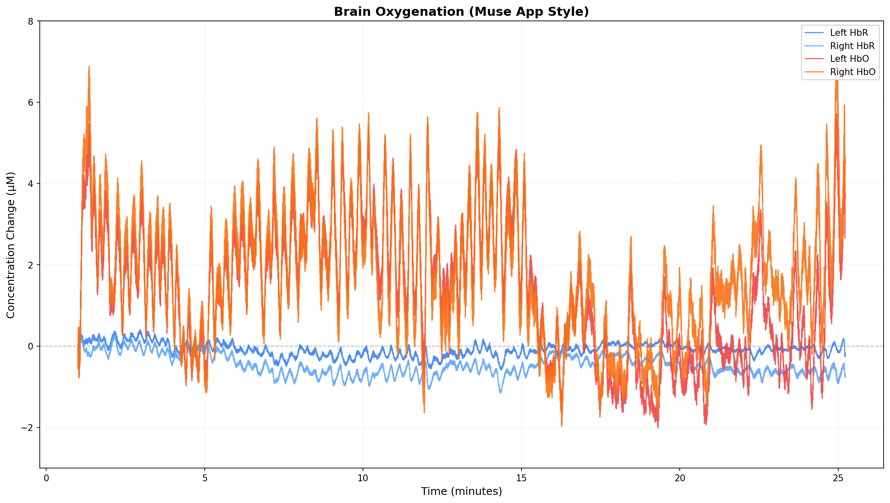
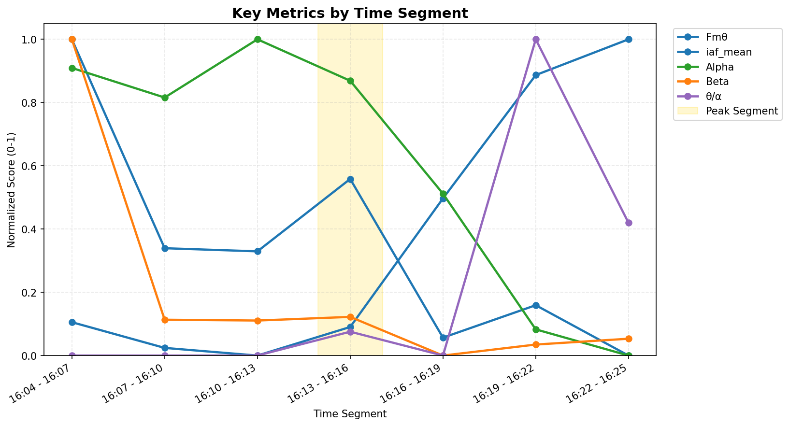

# Muse脳波データ分析レポート

- **生成日時**: 2025-11-16 17:01:18
- **データファイル**: `mindMonitor_2025-11-11--16-02-41_7664079854988147625.csv`
- **記録時間**: 2025-11-11 16:03:41 ~ 2025-11-11 16:27:55
- **計測時間**: 24.2 分

---

## 📡 接続品質

- **総合品質スコア**: 1.15
- **Good品質率**: 85.5%

### チャネル別詳細

| チャネル   |   Good (%) |   Medium (%) |   Bad (%) |   平均品質 |
|:-----------|-----------:|-------------:|----------:|-----------:|
| TP9        |      98.98 |         0.94 |      0.08 |       1.01 |
| AF7        |     100.00 |         0.00 |      0.00 |       1.00 |
| AF8        |      97.18 |         2.80 |      0.02 |       1.03 |
| TP10       |      45.96 |        53.88 |      0.16 |       1.54 |

> **注**: 1.0=Good, 2.0=Medium, 4.0=Bad

## 🧾 生データプレビュー

> **注**: フィルタ適用後EEGの初期数分（μV表示）。異常波形の早期チェック用。

## 📊 分析サマリー

### 総合評価

- **総合スコア**: 34.1/100

**スコア内訳**

- 瞑想深度 (Fmθ): 0.0/100
- 集中度 (SE): 52.1/100
- 瞑想深度 (θ/α): 45.8/100
- リラックス度 (α/β): 100.0/100
- 周波数安定性 (IAF): 0.0/100

### セッション総合評価

- **Delta平均 (Bels)**: -112.298
- **Theta平均 (Bels)**: -114.709
- **Alpha平均 (Bels)**: -114.626
- **Beta平均 (Bels)**: -118.058
- **Gamma平均 (Bels)**: -108.075
- **Spectral Entropy平均 (集中度)**: 0.858
- **α/β比平均 (ratio) - リラックス度**: 24790.388
- **β/θ比平均 (ratio) - 覚醒度**: 0.044
- **θ/α比平均 (ratio) - 瞑想深度**: 122.978
- **δ/β比平均 (ratio) - 睡眠傾向**: 193024943095058.781
- **γ/θ比平均 (ratio) - 認知負荷**: 3485018966.822
- **α/β比平均 (Bels) - リラックス度（対数）**: 3.432
- **β/θ比平均 (Bels) - 覚醒度（対数）**: -3.349
- **θ/α比平均 (Bels) - 瞑想深度（対数）**: -0.083
- **Fmθ平均 (μV²)**: 2.458
- **IAF平均 (Hz)**: 9.00 ± 0.00

### ピークパフォーマンス

- **最高パフォーマンス区間**: 16:13 - 16:16
- **スコア**: 58.4/100

## 🧠 周波数帯域分析

### バンドパワー時系列

### パワースペクトル密度（PSD）

### スペクトログラム

## 🎯 特徴的指標分析

### Frontal Midline Theta (Fmθ)

| Metric                  |   Value | Unit   |
|:------------------------|--------:|:-------|
| Mean                    |   2.458 | μV²    |
| Median                  |   1.823 | μV²    |
| Std Dev                 |   1.800 | μV²    |
| First Half Mean         |   3.152 | μV²    |
| Second Half Mean        |   1.764 | μV²    |
| Increase Rate (2nd/1st) | -44.051 | %      |

セッション後半の平均Fmθは前半比で **-44.1%** 変化しました。

### Peak Alpha Frequency (PAF)

**Individual Alpha Frequency (IAF)**: 9.00 ± 0.00 Hz

**チャネル別詳細**

| チャネル   |   PAF (Hz) |   Power (μV²/Hz) |
|:-----------|-----------:|-----------------:|
| TP9        |       9.00 |            11.84 |
| AF7        |       9.00 |             0.60 |
| AF8        |       9.00 |             2.07 |
| TP10       |       9.00 |            16.71 |

### Frontal Alpha Asymmetry (FAA)

| Metric           | Value                                                   | Unit    |
|:-----------------|:--------------------------------------------------------|:--------|
| Mean FAA         | 0.3134549298612461                                      | ln(μV²) |
| Median           | 0.25281250711575903                                     | ln(μV²) |
| Std Dev          | 0.3688101156876185                                      | ln(μV²) |
| First Half Mean  | 0.38730476031741284                                     | ln(μV²) |
| Second Half Mean | 0.23960509940507946                                     | ln(μV²) |
| Interpretation   | Left hemisphere dominant (Approach motivation/Positive) |         |

> **解釈**: FAA = ln(右) - ln(左)。正値は左半球優位（接近動機・ポジティブ感情）、負値は右半球優位（回避動機・ネガティブ感情）を示唆します。

### Spectral Entropy (SE)

| Metric                |   Value | Unit       |
|:----------------------|--------:|:-----------|
| Mean                  |   0.844 | normalized |
| Median                |   0.856 | normalized |
| Std Dev               |   0.079 | normalized |
| First Half Mean       |   0.831 | normalized |
| Second Half Mean      |   0.856 | normalized |
| Change Rate (2nd/1st) |   2.926 | %          |

セッション後半のエントロピーは前半比で **+2.9%** 変化しました。
**解釈**: 上昇（注意散漫）

> **解釈**: Spectral Entropyは周波数成分の多様性を示します。低い値は特定の周波数帯に集中（集中状態）、高い値は広帯域に分散（散漫状態）を示唆します。

### バンド比率指標

## 🩸 血流動態分析 (fNIRS)

### HbO/HbR時系列

### 統計サマリー

|        |   HbO平均 |   HbO標準偏差 |   HbO最小 |   HbO最大 |   HbR平均 |   HbR標準偏差 |   HbR最小 |   HbR最大 |
|:-------|----------:|--------------:|----------:|----------:|----------:|--------------:|----------:|----------:|
| 左半球 |      1.43 |          1.64 |     -2.01 |      5.72 |     -0.09 |          0.16 |     -0.59 |      0.41 |
| 右半球 |      1.83 |          1.58 |     -1.97 |      7.51 |     -0.46 |          0.26 |     -1.16 |      0.25 |

## ⏱️ 時間経過分析

### セグメント別パフォーマンス

### 詳細データ

|   No. | 時間帯        |   Fmθ平均 (μV²) |    SE |   IAF平均 (Hz) |   Alpha (Bels) |   Beta (Bels) |   θ/α比 (Bels) |   α/β比 (Bels) |   β/θ比 (Bels) | ピーク   |
|------:|:--------------|----------------:|------:|---------------:|---------------:|--------------:|---------------:|---------------:|---------------:|:---------|
|     1 | 16:04 - 16:07 |           3.499 | 0.866 |          9.148 |       -113.636 |      -115.480 |         -1.317 |          1.845 |         -0.527 |          |
|     2 | 16:07 - 16:10 |           2.176 | 0.881 |          9.049 |       -113.934 |      -118.355 |         -1.943 |          4.421 |         -2.478 |          |
|     3 | 16:10 - 16:13 |           2.157 | 0.864 |          9.019 |       -113.347 |      -118.363 |         -2.622 |          5.016 |         -2.394 |          |
|     4 | 16:13 - 16:16 |           2.615 | 0.711 |          9.130 |       -113.765 |      -118.326 |          1.638 |          4.561 |         -6.199 | ★        |
|     5 | 16:16 - 16:19 |           1.610 | 0.911 |          9.628 |       -114.901 |      -118.722 |         -1.480 |          3.821 |         -2.341 |          |
|     6 | 16:19 - 16:22 |           1.816 | 0.884 |         10.107 |       -116.268 |      -118.610 |          2.760 |          2.342 |         -5.102 |          |
|     7 | 16:22 - 16:25 |           1.497 | 0.889 |         10.245 |       -116.531 |      -118.550 |          2.383 |          2.019 |         -4.402 |          |

