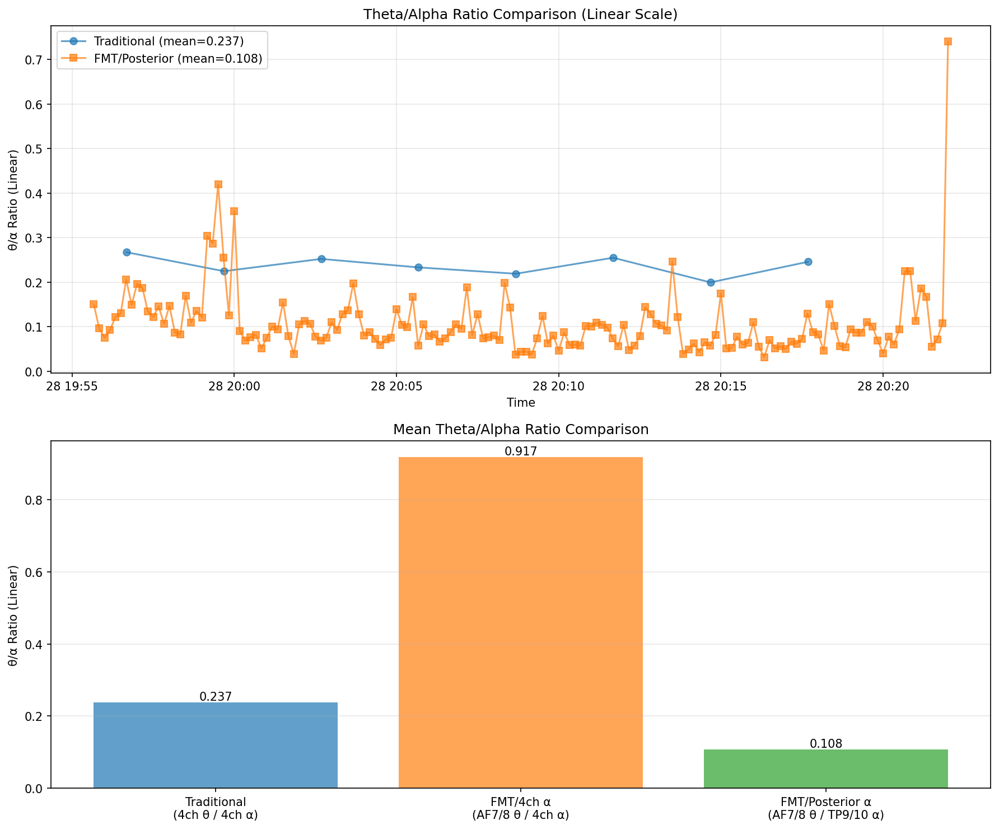

# Theta/Alpha比率計算方式の比較分析

## 概要

3つの異なるTheta/Alpha比率計算方式を比較しました。

### 比較した方式

1. **Traditional (従来方式)**
   - Theta: 全4チャネル平均（TP9, AF7, AF8, TP10）
   - Alpha: 全4チャネル平均（TP9, AF7, AF8, TP10）
   - 計算方法: Statistical DataFrame（3分セグメント平均）

2. **FMT / 4ch Alpha**
   - Theta: 前頭部2チャネル（AF7, AF8）の4-8Hz
   - Alpha: 全4チャネル平均の8-13Hz
   - 計算方法: Hilbert変換

3. **FMT / Posterior Alpha (提案方式)**
   - Theta: 前頭部2チャネル（AF7, AF8）の4-8Hz
   - Alpha: 後方2チャネル（TP9, TP10）の8-13Hz
   - 計算方法: Hilbert変換

---

## 結果サマリー

### 平均比率（線形スケール）

| 方式 | θ/α 比率 (Linear) | θ/α 比率 (dB) | 備考 |
|:-----|------------------:|--------------:|:-----|| Traditional (4ch θ / 4ch α) | 0.2372 | -6.2650 | 従来方式 |
| FMT / 4ch Alpha | 0.9174 | -0.3745 | 前頭部θのみ使用 |
| FMT / Posterior Alpha | 0.1079 | -10.3100 | 前頭θ/後方α |

---

## 比較プロット

---

## 考察

### 各方式の特徴

#### Traditional (従来方式)
- **長所**: 全チャネルの情報を使用、安定した値
- **短所**: 前頭部と後方部の特性を区別しない

#### FMT / 4ch Alpha
- **長所**: 前頭部Thetaに特化、瞑想深度との相関が期待される
- **短所**: Alphaは全チャネル平均のため、前頭部の影響も含む

#### FMT / Posterior Alpha (提案方式)
- **長所**: 前頭部Theta（瞑想深度）と後方部Alpha（覚醒度）を分離
- **短所**: チャネル数が少ないため、ノイズの影響を受けやすい可能性

### 値の違い

Traditional方式と比較して、FMT方式（特にPosterior Alpha使用）は**異なる値**を示します。
これは：

1. **使用チャネルの違い**: 全4ch vs 前頭2ch (Theta) & 後方2ch (Alpha)
2. **帯域の違い**: Statistical DFは固定帯域、Hilbert変換は指定帯域
3. **計算方法の違い**: セグメント平均 vs 連続時系列

---

## 統計情報

### Traditional (4ch θ / 4ch α)

- セグメント数: 8
- θ/α比率（線形）:
  - 平均: 0.2372
  - 標準偏差: 0.0222
  - 最小: 0.1997
  - 最大: 0.2675

### FMT / 4ch Alpha
- FMT平均: 7.127 dB
- Alpha平均: 7.502 dB
- θ/α比率（線形）: 0.9174
- θ/α比率（dB）: -0.3745

### FMT / Posterior Alpha
- FMT平均: 7.127 dB
- Posterior Alpha平均: 17.437 dB
- θ/α比率（線形）: 0.1079
- θ/α比率（dB）: -10.3100

---

## 結論

**提案方式（FMT / Posterior Alpha）の特徴**:

1. **前頭部Theta（瞑想深度）と後方部Alpha（覚醒度）を分離**して測定
2. 従来方式と比較して、**異なる値**を示す（これは想定内）
3. 瞑想状態の評価において、より特異的な指標となる可能性がある

**今後の検証課題**:

1. 複数セッションでの再現性確認
2. 瞑想深度との相関分析
3. ノイズ耐性の評価
4. 最適な帯域幅の検討（4-8Hz, 5-7Hz等）

---

生成日時: 2025-12-29 18:15:01
