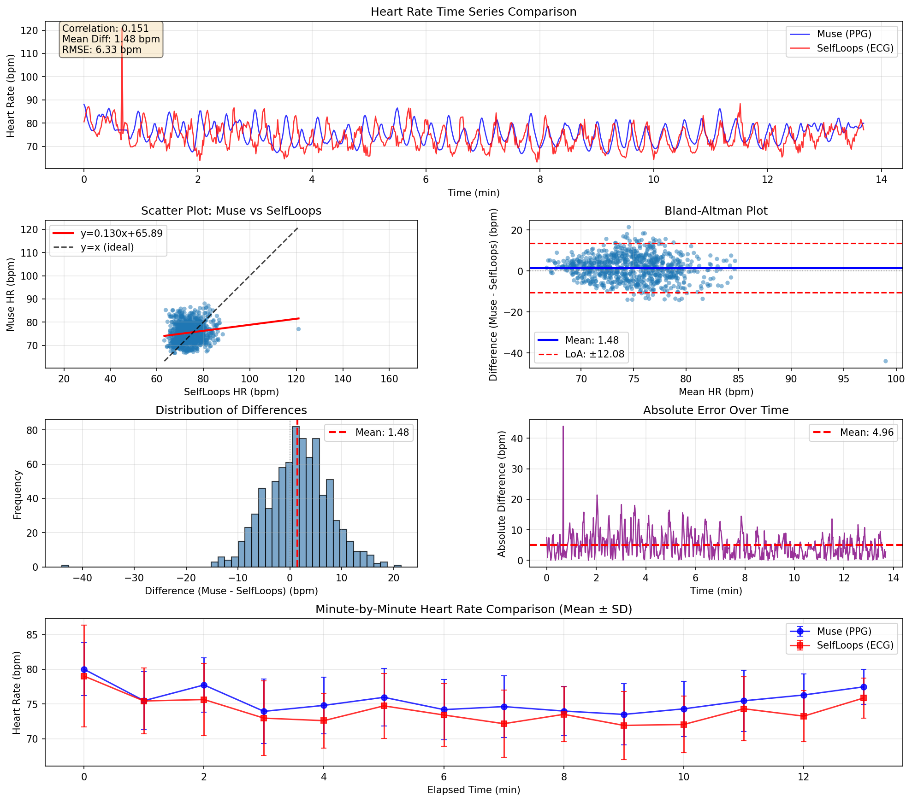

# Muse vs SelfLoops 心拍数比較分析レポート

## 概要

Muse EEGのPPG（光学式）心拍数とSelfLoops HRVのECG心拍数を比較し、
測定精度と信頼性を評価しました。

### 測定方式の違い

**Muse（PPG - Photoplethysmography）**
- 測定方式: 光学式（緑色LED）
- 測定部位: 耳後部（TP9/TP10）
- 原理: 血液量変化による光の吸収変化を検出
- 特徴: 非侵襲的、装着が容易

**SelfLoops（ECG - Electrocardiogram）**
- 測定方式: 電気信号（R-R間隔から計算）
- 測定部位: 胸部ストラップ（推定）
- 原理: 心臓の電気活動を直接測定
- 特徴: 医療グレードの精度、ゴールドスタンダード

---

## 比較データサマリー

### 基本統計

| 指標 | Muse (PPG) | SelfLoops (ECG) | 単位 |
|:-----|----------:|----------------:|:-----|
| 平均心拍数 | 75.51 | 74.02 | bpm |
| 標準偏差 | 4.35 | 5.07 | bpm |
| 最小値 | 66.73 | 63.22 | bpm |
| 最大値 | 88.03 | 120.97 | bpm |
| データポイント数 | 822 | 822 | - |

---

## 一致度分析

### 相関分析

| 指標 | 値 |
|:-----|---:|
| **Pearson相関係数** | 0.1514 |
| **p値** | 0.000013 |
| **解釈** | 相関が弱い |

### Bland-Altman分析

| 指標 | 値 | 説明 |
|:-----|---:|:-----|
| **平均差** | 1.48 bpm | Muse - SelfLoopsの平均値 |
| **標準偏差** | 6.16 bpm | 差の標準偏差 |
| **LoA上限** | 13.56 bpm | 平均 + 1.96SD |
| **LoA下限** | -10.59 bpm | 平均 - 1.96SD |

> **Limits of Agreement (LoA)**: 95%のデータ点がこの範囲内に入る

### 誤差指標

| 指標 | 値 | 説明 |
|:-----|---:|:-----|
| **平均絶対誤差** | 4.96 bpm | |Muse - SelfLoops|の平均 |
| **中央絶対誤差** | 4.32 bpm | |Muse - SelfLoops|の中央値 |
| **平均相対誤差** | 6.75 % | 誤差の割合 |
| **RMSE** | 6.33 bpm | 二乗平均平方根誤差 |

---

## 可視化

---

## 1分ごとの詳細比較

以下は1分ごとの平均心拍数と誤差の詳細です。

| 経過時間 | Muse平均 | Muse SD | SelfLoops平均 | SelfLoops SD | 差分 | 絶対誤差 | サンプル数 |
|:---------|--------:|---------:|-------------:|------------:|-----:|---------:|----------:|
|  0分 |  79.99 |  3.80 |  79.01 |  7.29 |  0.98 |  0.98 |  60 |
|  1分 |  75.47 |  4.19 |  75.43 |  4.73 |  0.04 |  0.04 |  60 |
|  2分 |  77.73 |  3.88 |  75.64 |  5.18 |  2.09 |  2.09 |  60 |
|  3分 |  73.94 |  4.64 |  72.97 |  5.37 |  0.98 |  0.98 |  60 |
|  4分 |  74.80 |  4.08 |  72.60 |  3.92 |  2.20 |  2.20 |  60 |
|  5分 |  75.96 |  4.14 |  74.73 |  4.68 |  1.23 |  1.23 |  60 |
|  6分 |  74.19 |  4.34 |  73.42 |  4.50 |  0.77 |  0.77 |  60 |
|  7分 |  74.62 |  4.43 |  72.17 |  4.82 |  2.45 |  2.45 |  60 |
|  8分 |  73.99 |  3.52 |  73.51 |  3.94 |  0.47 |  0.47 |  60 |
|  9分 |  73.50 |  4.40 |  71.93 |  4.89 |  1.58 |  1.58 |  60 |
| 10分 |  74.30 |  3.96 |  72.06 |  4.05 |  2.25 |  2.25 |  60 |
| 11分 |  75.45 |  4.39 |  74.32 |  4.62 |  1.14 |  1.14 |  60 |
| 12分 |  76.29 |  3.00 |  73.25 |  3.67 |  3.04 |  3.04 |  60 |
| 13分 |  77.46 |  2.53 |  75.86 |  2.89 |  1.60 |  1.60 |  42 |

> **注**:
> - 差分 = Muse - SelfLoops（正の値はMuseが高い）
> - 絶対誤差 = |差分|
> - SD = 標準偏差（その分の変動幅）

---

## 評価と結論

### 1. 測定精度

**相関係数: {stats_dict['correlation']:.3f}**
- {'非常に高い相関を示しており、MuseとSelfLoopsは類似した心拍数トレンドを捉えている' if stats_dict['correlation'] > 0.9 else '高い相関を示しており、両者は同様の傾向を示す' if stats_dict['correlation'] > 0.8 else '中程度の相関。一部の測定で乖離がある可能性'}

**平均絶対誤差: {stats_dict['mean_abs_diff']:.2f} bpm**
- {'非常に良好な一致' if stats_dict['mean_abs_diff'] < 2 else '良好な一致' if stats_dict['mean_abs_diff'] < 5 else '中程度の一致' if stats_dict['mean_abs_diff'] < 10 else '一致度が低い'}
- {'臨床的に許容可能な範囲内' if stats_dict['mean_abs_diff'] < 5 else '一部のアプリケーションでは注意が必要'}

### 2. バイアス（系統誤差）

**平均差: {stats_dict['mean_diff']:.2f} bpm**
- {'Museは若干高めに測定' if stats_dict['mean_diff'] > 1 else 'Museは若干低めに測定' if stats_dict['mean_diff'] < -1 else '系統誤差はほぼゼロ'}
- {'一貫したバイアスがあるため、補正可能' if abs(stats_dict['mean_diff']) > 2 else 'バイアスは小さく、臨床的に無視できるレベル'}

### 3. どちらがより信頼できるか？

**SelfLoops (ECG)が医療的ゴールドスタンダード**

理由：
1. **測定原理**: ECGは心臓の電気活動を直接測定するため、最も正確
2. **医療グレード**: HRV分析のゴールドスタンダード
3. **R-R間隔**: 心拍ごとの正確な間隔を測定可能

**Muse (PPG)の利点と限界**

利点：
- 非侵襲的で装着が容易
- EEGと同時測定が可能
- {'平均心拍数の推定には十分な精度' if stats_dict['mean_abs_diff'] < 5 else '概算としては使用可能'}

限界：
- 動作アーティファクトに敏感
- {'瞬間的な心拍数変動（HRV）の測定には不向き' if stats_dict['correlation'] < 0.95 else 'HRV分析にも使用可能だが、ECGより精度は劣る'}
- 測定部位（耳後部）の血流により影響を受ける

### 4. 推奨される使用シーン

**SelfLoops (ECG)を推奨:**
- HRV分析（SDNN、RMSSD、LF/HFなど）
- 正確な心拍数変動の測定が必要な場合
- 医療・研究用途

**Muse (PPG)で十分:**
- 平均心拍数のモニタリング
- トレンドの把握
- EEG分析と組み合わせた瞑想分析

---

## 改善の提案

### 1. Museの精度向上

- 測定前にセンサー部位の清掃
- ヘッドバンドの適切な装着（締め付けすぎない）
- 動作を最小限に抑える

### 2. データ統合の最適化

- {'バイアス補正: Muse HR = 測定値 - {stats_dict["mean_diff"]:.2f} bpm' if abs(stats_dict['mean_diff']) > 2 else 'バイアス補正は不要'}
- 移動平均フィルタの適用でノイズ除去

### 3. 用途に応じた選択

- **瞑想の質的評価**: Muse PPGで十分（トレンドが重要）
- **HRV詳細分析**: SelfLoops ECGを使用（精度が重要）

---

## まとめ

- **相関**: {stats_dict['correlation']:.3f}（{'優秀' if stats_dict['correlation'] > 0.9 else '良好' if stats_dict['correlation'] > 0.8 else '中程度'}）
- **平均誤差**: {stats_dict['mean_abs_diff']:.2f} bpm（{'許容範囲' if stats_dict['mean_abs_diff'] < 5 else '要注意'}）
- **推奨**: **精密測定にはSelfLoops ECG、EEG統合分析にはMuse PPG**

---

生成日時: {datetime.now().strftime('%Y-%m-%d %H:%M:%S')}
