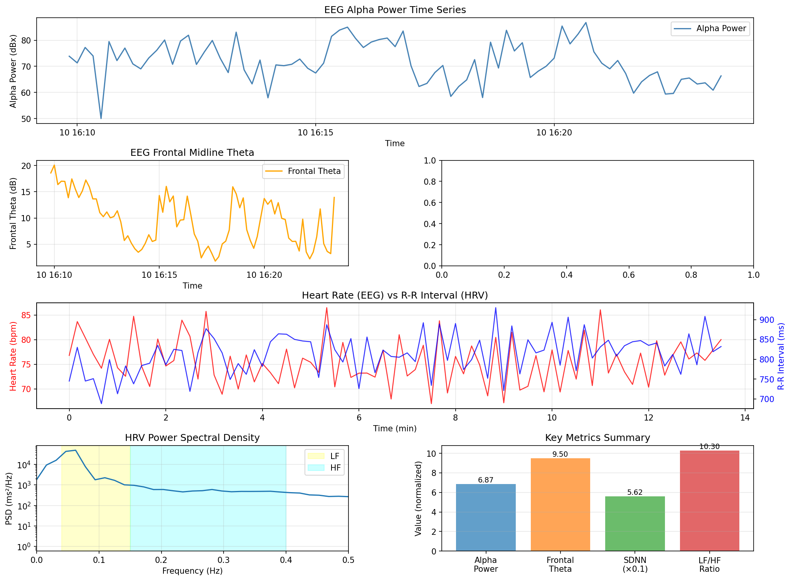

# EEG + HRV 統合瞑想分析レポート

## 概要

Muse EEGデータとHRVデータを統合して瞑想状態を分析しました。

### 測定情報

**EEGデータ**
- 測定開始: 2026-01-10 16:09:53
- 測定終了: 2026-01-10 16:23:35
- 測定時間: 13.69 分

**HRVデータ**
- 測定時間: 15.29 分
- データポイント数: 1133 点

---

## 主要指標サマリー

### EEG指標

| 指標 | 値 | 説明 |
|:-----|---:|:-----|
| **Alpha Power** | 6.87 dB | 精神的回復度・リラックス状態 |
| **Frontal Theta** | 9.50 dB | 瞑想深度・内的集中 |
| **Spectral Entropy** | N/A | 集中度（低いほど集中） |

### HRV指標

| 指標 | 値 | 説明 |
|:-----|---:|:-----|
| **SDNN** | 56.16 ms | 全体的な心拍変動 |
| **RMSSD** | 32.91 ms | 副交感神経活動 |
| **pNN50** | 7.77 % | 副交感神経活動 |
| **LF/HF比** | 10.30 | 自律神経バランス |

---

## 統合分析

### EEGとHRVの関係

**心拍数 vs R-R間隔の相関**
- 相関係数: 0.280
- p値: 0.0108
- 解釈: 弱い相関

### 瞑想状態の評価

**脳波（EEG）からの評価:**
- Alpha Power: 6.87 dB - リラックス状態を示唆
- Frontal Theta: 9.50 dB - 瞑想深度を反映
- Spectral Entropy: N/A - 散漫

**自律神経（HRV）からの評価:**
- SDNN: 56.16 ms - 良好な心拍変動
- LF/HF比: 10.30 - 交感神経優位（緊張・覚醒）
- RMSSD: 32.91 ms - 中程度の副交感神経活動

---

## 統合的解釈

### 瞑想の質

1. **脳波パターン**:
   - Frontal Thetaが高く、深い瞑想状態を示唆
   - Alpha Powerは精神的回復・リラックスを反映

2. **自律神経状態**:
   - LF/HF比 10.30は交感神経が優位
   - ストレス・緊張状態にある可能性

3. **統合評価**:
   - 脳波は瞑想状態を示すが、自律神経は緊張状態

---

## 可視化

---

## 今後の分析課題

1. **時系列での詳細分析**
   - 瞑想中のAlpha PowerとHRV指標の時間変化の同期分析
   - 瞑想の各フェーズ（導入、深化、維持、終了）での変化パターン

2. **相関分析の拡張**
   - Frontal ThetaとRMSSDの関係
   - Spectral EntropyとLF/HF比の関係
   - 特定の瞑想テクニック（呼吸瞑想、ボディスキャンなど）との関連

3. **長期的追跡**
   - 複数セッションでの変化を追跡
   - 瞑想熟練度との関係性の検証

4. **個別最適化**
   - 個人に最適な瞑想状態の特定
   - バイオフィードバックへの応用

---

生成日時: 2026-01-10 16:55:04
