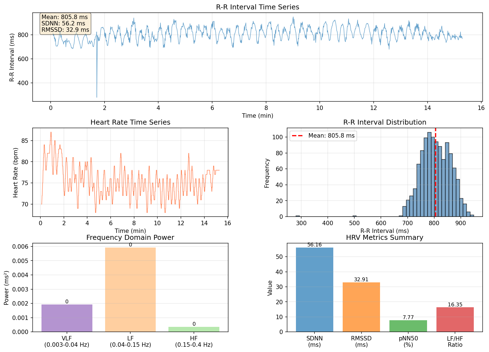

# HRV (Heart Rate Variability) 分析レポート

## 概要

SelfLoops HRV dataから心拍変動(HRV)を分析しました（NeuroKit2使用）。

### 測定情報

- **測定時間**: 15.29 分
- **データポイント数**: 1133 点
- **測定開始日時**: 2026-01-10 16:08:50

---

## 基本統計

### 心拍数 (HR)

| 指標 | 値 |
|:-----|---:|
| 平均 | 75.51 bpm |
| 最小 | 68 bpm |
| 最大 | 87 bpm |
| 標準偏差 | 3.66 bpm |

### R-R間隔

| 指標 | 値 |
|:-----|---:|
| 平均 | 805.77 ms |
| 最小 | 280 ms |
| 最大 | 949 ms |
| 標準偏差 | 56.16 ms |

---

## HRV指標

### 時間領域指標

| 指標 | 値 | 説明 |
|:-----|---:|:-----|
| **SDNN** | 56.16 ms | R-R間隔の標準偏差。全体的な心拍変動の指標 |
| **RMSSD** | 32.91 ms | 連続R-R間隔差の二乗平均平方根。副交感神経活動の指標 |
| **pNN50** | 7.77 % | 50ms以上異なる連続R-R間隔の割合。副交感神経活動の指標 |

#### SDNN評価基準（参考値）

- **100 ms以上**: 優秀
- **50-100 ms**: 良好
- **20-50 ms**: 低下
- **20 ms未満**: 著しく低下

現在の値: **56.16 ms** - 良好

### 周波数領域指標

| 指標 | 値 | 説明 |
|:-----|---:|:-----|
| **VLF Power** | 0.00 ms² | 超低周波成分 (0.003-0.04 Hz) |
| **LF Power** | 0.01 ms² | 低周波成分 (0.04-0.15 Hz)。交感神経と副交感神経の両方 |
| **HF Power** | 0.00 ms² | 高周波成分 (0.15-0.4 Hz)。副交感神経活動 |
| **LF/HF比** | 16.35 | 交感神経/副交感神経バランスの指標 |
| **LF (n.u.)** | 0.71 % | 正規化LF |
| **HF (n.u.)** | 0.04 % | 正規化HF |

#### LF/HF比の評価

- **1.5-2.0**: バランスが取れている
- **2.0以上**: 交感神経優位（ストレス状態）
- **1.0未満**: 副交感神経優位（リラックス状態）

現在の値: **16.35** - 交感神経優位

---

## 可視化

---

## 解釈

### 時間領域指標からの評価

SDNNは **56.16 ms** で、良好な心拍変動を示しています。

RMSSDは **32.91 ms** で、中程度の副交感神経活動を示唆しています。

pNN50は **7.77%** です。中程度の値（5-20%）です。

### 周波数領域指標からの評価

LF/HF比は **16.35** で、自律神経系が交感神経優位の状態にあることを示しています。

---

## 考察

### HRV指標の臨床的意義

1. **SDNN**: 全体的な自律神経機能を反映。運動、ストレス、睡眠の質などに影響される
2. **RMSSD**: 短期的な心拍変動を反映。呼吸や副交感神経活動に敏感
3. **LF/HF比**: 交感神経と副交感神経のバランスを示す

### この測定結果の特徴

- 測定時間: 15.29分
- 平均心拍数: 74.5 bpm
- 心拍変動レベル: 高い

---

## 技術情報

- **解析ライブラリ**: NeuroKit2
- **HRV指標数**: 91 個
- **データソース**: SelfLoops HRV

---

## 今後の分析課題

1. 時系列での変化を追跡（朝晩の違い、日々の変化など）
2. 瞑想セッション前後でのHRV変化の比較
3. 他の生理指標（EEG、呼吸など）との相関分析
4. ストレスイベントや運動との関連性の検討

---

生成日時: 2026-01-10 17:57:29
