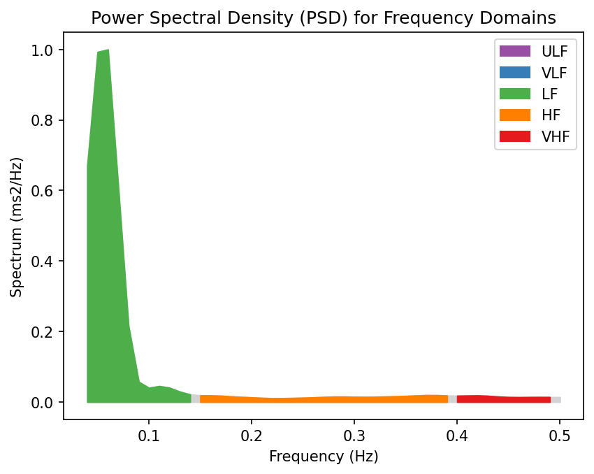
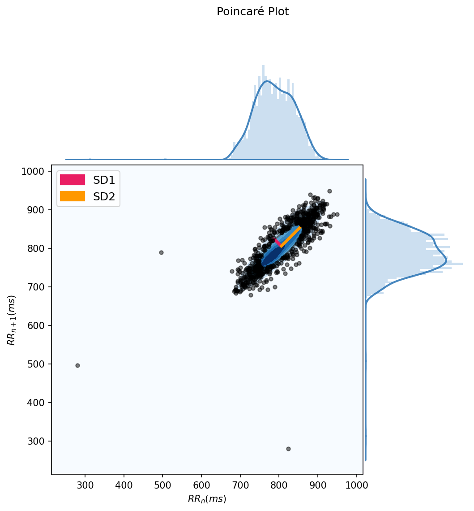
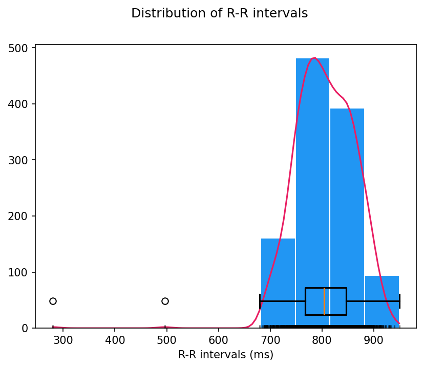

# HRV分析レポート（簡易版）

## 測定情報

- **測定日時**: 2026-01-10 16:08:50
- **測定時間**: 15.3分
- **データポイント数**: 1133点
- **平均心拍数**: 74.5 bpm

---

## 主要HRV指標

### 時間領域

| 指標 | 値 | 評価 |
|:-----|---:|:-----|
| **SDNN** | 56.2 ms | ✅ 良好 |
| **RMSSD** | 32.9 ms | ⭕ 中程度 |
| **pNN50** | 7.8% | ⭕ 中程度 |

### 周波数領域

| 指標 | 値 | 評価 |
|:-----|---:|:-----|
| **LF Power** | 0.01 ms² | 低周波成分 (0.04-0.15 Hz) |
| **HF Power** | 0.00 ms² | 高周波成分 (0.15-0.4 Hz) |
| **LF/HF比** | 16.35 | ⚠️ 交感神経優位 |

---

## 解釈

**自律神経バランス**: LF/HF比が16.35で、交感神経優位（ストレス状態）です。

**心拍変動レベル**: SDNN 56.2msは良好な心拍変動を示しています。

**副交感神経活動**: RMSSD 32.9msは中程度の副交感神経活動を示唆しています。

---

## 可視化

### 周波数領域分析

### Poincaréプロット

### 時間領域分析

---

## 技術情報

- **解析ライブラリ**: NeuroKit2
- **計算されたHRV指標**: 91個
- **データソース**: SelfLoops HRV

---

*生成日時: 2026-01-10 18:01:16*
