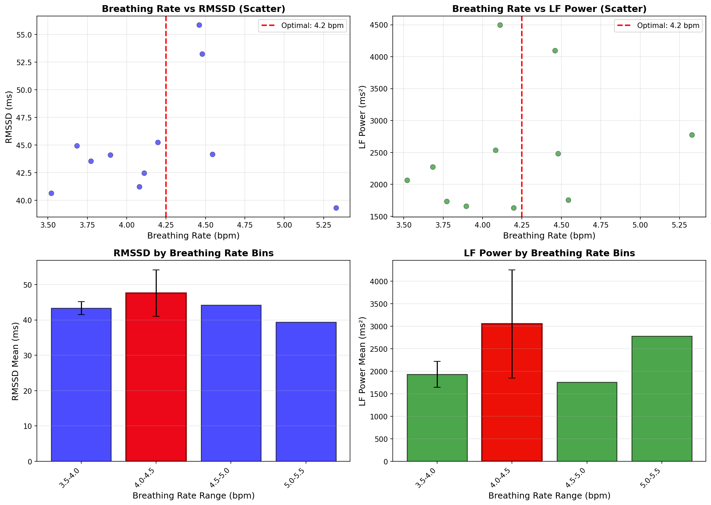
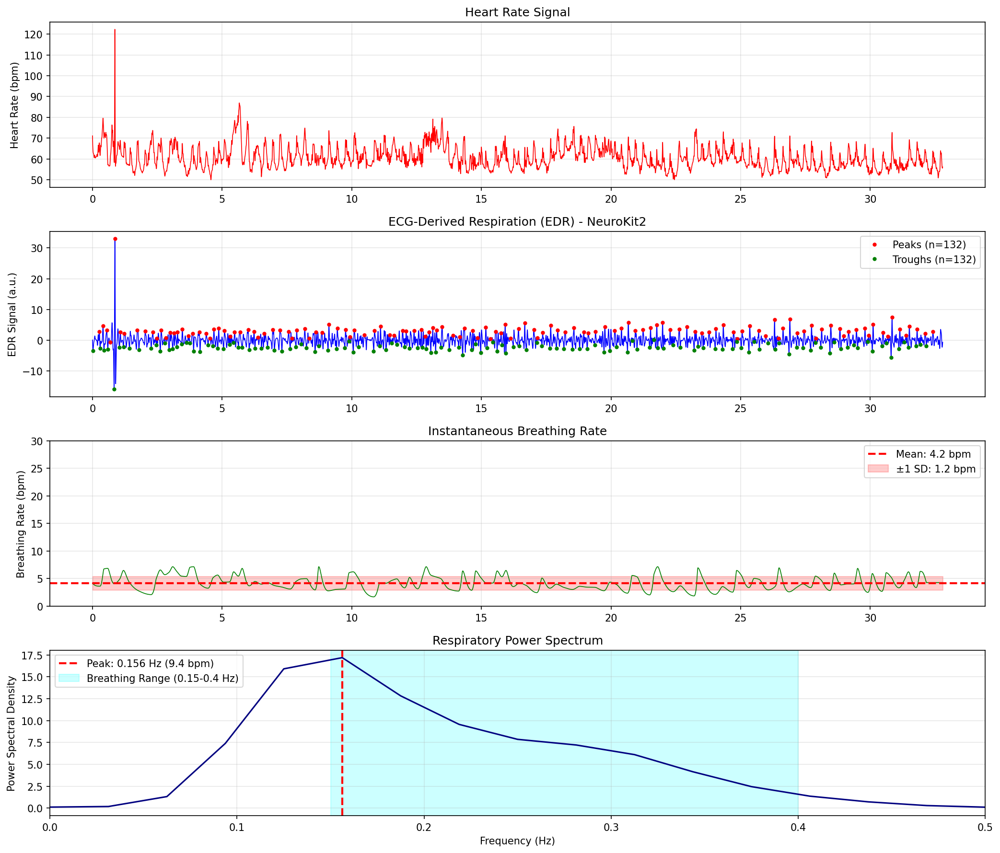

# ECG呼吸分析レポート

## 概要

NeuroKit2を使用してECGのR-R間隔データから呼吸パターンを推定しました。
ECG-Derived Respiration (EDR) 法による分析です。

## 主要指標

| 指標 | 値 |
|:-----|---:|
| **測定時間** | 32.89 分 |
| **平均呼吸数（瞬時）** | 4.2 ± 1.2 bpm |
| **スペクトル法による呼吸数** | 9.4 bpm |
| **検出されたピーク数** | 132 |
| **検出されたトラフ数** | 132 |

## 時系列変化（3分ごと）

| Time (min) | HR (bpm) | RMSSD (ms) | LF/HF | LF Power (ms^2) | HF Power (ms^2) | BR (bpm) |
|:-----:|:-----:|:-----:|:-----:|:-----:|:-----:|:-----:|
| 1.5 | 62.4 | 55.9 | 2.1 | 4095.1 | 1974.8 | 4.5 |
| 4.5 | 62.6 | 39.3 | 11.5 | 2778.2 | 242.0 | 5.3 |
| 7.5 | 60.9 | 42.5 | 17.6 | 4495.4 | 254.9 | 4.1 |
| 10.5 | 61.7 | 43.5 | 5.0 | 1733.7 | 348.8 | 3.8 |
| 13.5 | 63.0 | 53.3 | 5.7 | 2483.0 | 438.9 | 4.5 |
| 16.5 | 59.3 | 45.3 | 4.0 | 1632.4 | 411.1 | 4.2 |
| 19.5 | 63.4 | 40.7 | 9.0 | 2064.8 | 229.7 | 3.5 |
| 22.5 | 59.0 | 44.9 | 5.0 | 2273.9 | 457.9 | 3.7 |
| 25.5 | 59.4 | 44.1 | 6.1 | 1659.6 | 272.6 | 3.9 |
| 28.5 | 58.1 | 41.2 | 7.5 | 2533.3 | 337.5 | 4.1 |
| 31.4 | 57.8 | 44.2 | 3.7 | 1753.0 | 469.9 | 4.5 |

**指標の説明:**
- **Time (min)**: ウィンドウの中央時刻（分）
- **HR (bpm)**: 心拍数（beats per minute）
- **RMSSD (ms)**: 連続R-R間隔差の二乗平均平方根（副交感神経活動の指標）
- **LF/HF**: 低周波/高周波比（自律神経バランスの指標）
- **LF Power (ms²)**: 低周波パワー（0.04-0.15 Hz、交感神経・副交感神経活動）
- **HF Power (ms²)**: 高周波パワー（0.15-0.4 Hz、副交感神経活動・呼吸の影響）
- **BR (bpm)**: 呼吸数（breaths per minute）

## 推奨呼吸数（共鳴周波数推定）

このセクションでは、30分の瞑想データから呼吸数とHRV振幅の関係を分析し、
HRV振幅が最大化される呼吸数範囲を推定しています。

### RMSSD基準（副交感神経活動）
- **推奨範囲**: 4.0-4.5 bpm
- **中心値**: 4.2 bpm
- **平均RMSSD**: 47.6 ms

### LF Power基準（心臓血管系共鳴）
- **推奨範囲**: 4.0-4.5 bpm
- **中心値**: 4.2 bpm
- **平均LF Power**: 3047.9 ms²

**注意事項:**
- これらは自然な瞑想データからの探索的推定値です
- より正確な共鳴周波数を知るには、4.5-6.5 bpmの範囲で制御された呼吸測定が必要です
- 個人の共鳴周波数は日によって変動する可能性があります（平均心拍数との関連）

### 相関分析

## 使用した関数

- `nk.ecg_rsp()`: ECG-Derived Respiration（EDR）抽出
- `nk.rsp_clean()`: 呼吸信号のクリーニング
- `nk.rsp_findpeaks()`: 呼吸ピーク検出
- `nk.rsp_rate()`: 呼吸数計算

## 可視化

---

生成日時: 2026-01-12 16:46:39
