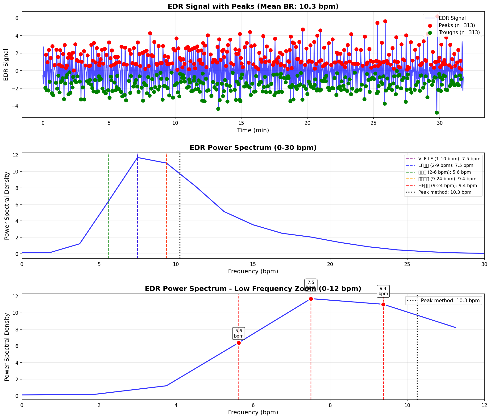

# 呼吸数（BR）妥当性検証レポート
## 概要
深い瞑想状態における呼吸数推定の妥当性を検証しました。
## データ情報
- **測定時間**: 31.7 分
- **R-R間隔数**: 1924
- **平均心拍数**: 60.5 bpm

## ユーザー証言
- **実際の呼吸周期**: 15-30秒/回
- **推定呼吸数**: 2-4 bpm

## 検証結果

### 1. ピーク検出法

- **平均呼吸数**: 10.3 ± 3.7 bpm
- **平均呼吸周期**: 5.9 秒/回
- **検出ピーク数**: 313
- **評価**: 要確認

### 2. スペクトル法（複数範囲）

| 周波数範囲 | 呼吸数 (bpm) | 呼吸周期 (秒) | 評価 |
|:-----------|-------------:|--------------:|:-----|
| VLF-LF (1-10 bpm) | 7.5 | 8.0 | △ やや速い |
| LF帯域 (2-9 bpm) | 7.5 | 8.0 | △ やや速い |
| 深呼吸 (2-6 bpm) | 5.6 | 10.7 | ✓ 妥当 |
| 通常呼吸 (9-24 bpm) | 9.4 | 6.4 | △ やや速い |
| HF帯域 (9-24 bpm) | 9.4 | 6.4 | △ やや速い |

## 結論

**推奨される呼吸数推定方法:**

- **深呼吸 (2-6 bpm)**: 5.6 bpm (10.7秒/回)

**問題点:**

- 現在の実装で使用している「通常呼吸 (9-24 bpm)」範囲は、深い瞑想状態には適していません
- この範囲で検出される9.4 bpmは、実際の呼吸ではなく別の生理現象（Mayer波など）の可能性があります

**推奨事項:**

- 深い瞑想データには「深呼吸 (2-6 bpm)」または「LF帯域 (2-9 bpm)」範囲を使用すべき
- ピーク検出法の結果も参考にして、適応的に範囲を選択する実装が望ましい

## 可視化

---

生成日時: 2026-01-16 21:33:00
