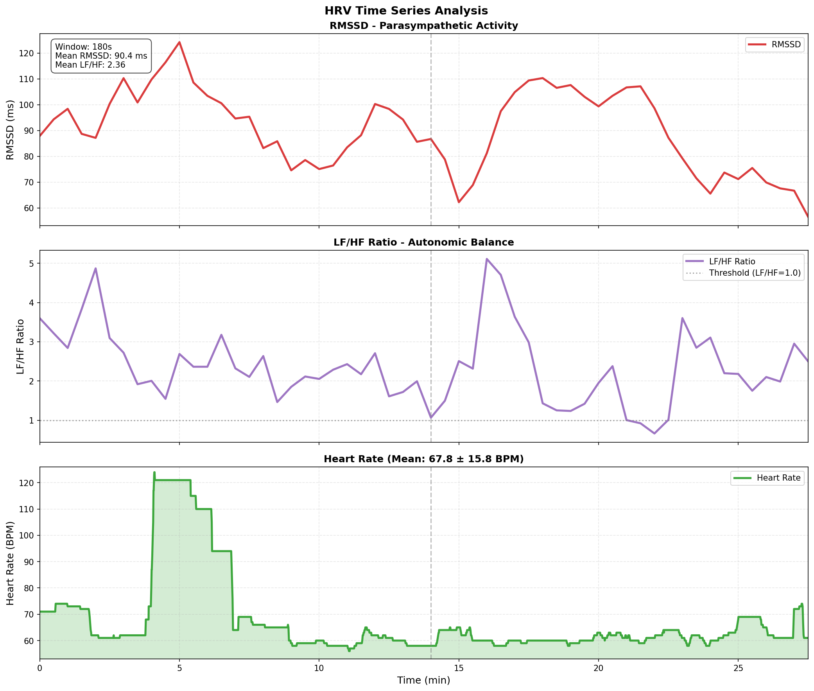
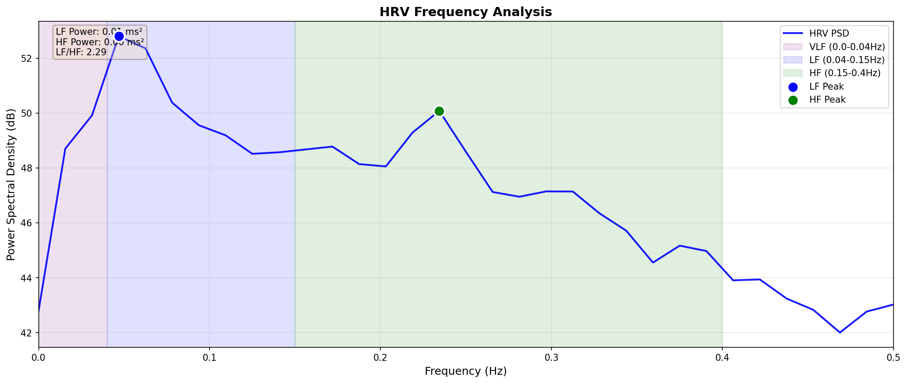

# HRV解析レポート

**生成日時**: 2026-01-16 17:18:11
**データファイル**: selfloops_2026-01-16--07-18-39.csv
**記録時間**: 2026-01-16 07:19:44 ~ 2026-01-16 07:50:32
**計測時間**: 30.8 分

---

## 🫀 自律神経系分析(ECG)

### 時間領域解析

> **時系列の見方**:
> - **RMSSD**: 副交感神経活動の指標。高いほどリラックス状態。
> - **LF/HF Ratio**: 自律神経バランス。1.0未満は副交感神経優位（リラックス）、1.0以上は交感神経優位（緊張）。

### 周波数領域解析

> **周波数帯域の説明**:
> - **VLF (0.0-0.04 Hz)**: Very Low Frequency - 長期的な調節機構
> - **LF (0.04-0.15 Hz)**: Low Frequency - 交感神経＋副交感神経活動（圧受容体反射）
> - **HF (0.15-0.4 Hz)**: High Frequency - 副交感神経活動（呼吸性洞性不整脈）

### 統計指標

#### Time Domain

| Metric   |   Value | Unit   |
|:---------|--------:|:-------|
| SDNN     |  155.18 | ms     |
| RMSSD    |   90.71 | ms     |
| pNN50    |   35.53 | %      |
| MeanNN   |  919.13 | ms     |
| MedianNN |  969.00 | ms     |
| CVNN     |    0.17 | %      |
| SDSD     |   90.73 | ms     |

#### Frequency Domain

| Metric      |   Value | Unit   |
|:------------|--------:|:-------|
| VLF         |    0.00 | ms²    |
| LF          |    0.01 | ms²    |
| HF          |    0.00 | ms²    |
| LF/HF       |    2.29 | -      |
| Total Power |    0.01 | ms²    |

> **指標の説明**:
> - **時間領域（Time Domain）**: R-R間隔の変動を時間で評価。SDNN/RMSSDが高いほど心拍変動が大きく、リラックス状態。
> - **周波数領域（Frequency Domain）**: 心拍変動を周波数解析。HFは副交感神経、LFは交感神経＋副交感神経の混合。
> - **非線形（Nonlinear）**: Poincaréプロットによる複雑性評価。SD1は短期変動、SD2は長期変動。
>
> **⚠️ LF/HF比の解釈について**: 呼吸数が3.8回/分と非常に遅いため、呼吸性変動がLF帯域（2.4-9回/分）に集中しています。この場合、LF/HF比の従来解釈（>2.5=交感神経優位）は**適用できません**。むしろ深い瞑想状態を示唆しています。

### 呼吸指標

| 指標 | 値 | 単位 |
|:-----|-----:|:-----|
| 平均呼吸数 | 3.8 | bpm |
| 呼吸数（標準偏差） | 1.2 | bpm |
| 呼吸数（スペクトル法） | 9.4 | bpm |
| 検出ピーク数 | 121 | 回 |
| 検出トラフ数 | 121 | 回 |

#### 共鳴呼吸回数（Resonance Breathing Pace）

| BR Range   |   BR Center (bpm) |   Count |   RMSSD Mean (ms) |   RMSSD Std (ms) |   LF Power Mean (ms^2) |   LF Power Std (ms^2) |
|:-----------|------------------:|--------:|------------------:|-----------------:|-----------------------:|----------------------:|
| 3.0-3.5    |              3.25 |       2 |             75.06 |            18.13 |                7635.69 |               5308.29 |
| 3.5-4.0    |              3.75 |       6 |             90.12 |            25.41 |                8258.17 |               4901.95 |
| 4.0-4.5    |              4.25 |       3 |             82.65 |            21.18 |                4662.26 |               1788.98 |

> **共鳴呼吸（Resonance Breathing）**: 呼吸のペースと心拍の周期が共鳴し、HRV（特にRMSSD）が最大化される呼吸回数。通常4.5-6.5回/分が最適値。

---

*Generated by Satoru HRV Analyzer*