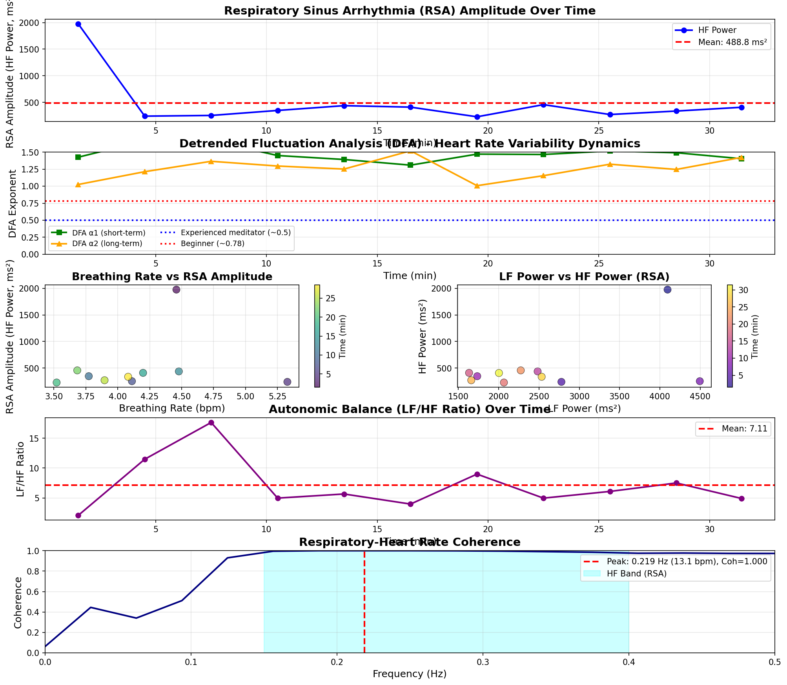

# 呼吸性洞性不整脈（RSA）分析レポート

## 概要

呼吸性洞性不整脈（Respiratory Sinus Arrhythmia: RSA）は、呼吸に同期して心拍数が変動する正常な生理現象で、
副交感神経（迷走神経）活動の指標として重要です。

このレポートでは、ECGのR-R間隔データからRSAを定量化し、瞑想の習熟度を評価しました。

## 主要指標サマリー

| 指標 | 値 |
|:-----|---:|
| **測定時間** | 32.89 分 |
| **平均呼吸数** | 4.2 ± 1.2 bpm |
| **平均RSA振幅（HF Power）** | 488.8 ± 476.4 ms² |
| **平均DFA α1** | 1.478 ± 0.104 |
| **平均LF/HF比** | 7.11 ± 4.11 |

## RSA分析結果

### RSA振幅（HF Power）

- **平均**: 488.8 ms²
- **標準偏差**: 476.4 ms²

RSA振幅はHF成分（0.15-0.4 Hz）のパワーで評価しています。
高い値ほど、呼吸による心拍調節が効果的であることを示します。

### DFA（ゆらぎ解析）

- **平均DFA α1**: 1.478
- **評価**: **初心者レベル** (DFA ≥ 0.9)
- **解釈**: より規則的な心拍パターン

**参考値（文献より）:**
- 経験豊富な禅瞑想者: DFA ≈ 0.5
- 初心者: DFA ≈ 0.78

**出典**: Hoshiyama, M., & Hoshiyama, A. (2008). "Heart rate variability associated with experienced Zen meditation",
2008 Computers in Cardiology.

### 自律神経バランス（LF/HF比）

- **平均LF/HF比**: 7.11

LF/HF比が低いほど副交感神経優位（リラックス状態）を示します。
- < 1.0: 副交感神経優位
- 1.0-2.0: バランス
- > 2.0: 交感神経優位

### 呼吸-心拍コヒーレンス

- **最大コヒーレンス値**: 1.000
- **最大コヒーレンス周波数**: 0.219 Hz (13.1 bpm)

コヒーレンスが高い（>0.7）場合、呼吸と心拍が高度に同期しています。

## 時系列データ（3分ごと）

| Time (min) | RSA Amplitude (HF Power, ms^2) | DFA α1 | DFA α2 | RMSSD (ms) | SDNN (ms) | LF Power (ms^2) | HF Power (ms^2) | LF/HF |
|:-----:|:-----:|:-----:|:-----:|:-----:|:-----:|:-----:|:-----:|:-----:|
| 1.50 | 1974.80 | 1.43 | 1.02 | 55.85 | 98.40 | 4095.13 | 1974.80 | 2.07 |
| 4.50 | 241.97 | 1.67 | 1.21 | 39.33 | 107.14 | 2778.20 | 241.97 | 11.48 |
| 7.50 | 254.85 | 1.67 | 1.36 | 42.47 | 80.31 | 4495.44 | 254.85 | 17.64 |
| 10.50 | 348.78 | 1.45 | 1.30 | 43.54 | 63.27 | 1733.74 | 348.78 | 4.97 |
| 13.50 | 438.87 | 1.39 | 1.25 | 53.25 | 88.82 | 2483.00 | 438.87 | 5.66 |
| 16.50 | 411.09 | 1.31 | 1.52 | 45.25 | 64.81 | 1632.43 | 411.09 | 3.97 |
| 19.50 | 229.66 | 1.47 | 1.01 | 40.66 | 65.80 | 2064.75 | 229.66 | 8.99 |
| 22.50 | 457.88 | 1.47 | 1.15 | 44.95 | 79.35 | 2273.86 | 457.88 | 4.97 |
| 25.50 | 272.57 | 1.52 | 1.32 | 44.13 | 73.48 | 1659.61 | 272.57 | 6.09 |
| 28.50 | 337.54 | 1.49 | 1.25 | 41.24 | 64.01 | 2533.31 | 337.54 | 7.51 |
| 31.45 | 408.58 | 1.40 | 1.42 | 44.82 | 66.69 | 2003.23 | 408.58 | 4.90 |

**指標の説明:**
- **RSA Amplitude (HF Power)**: 呼吸性洞性不整脈の振幅（HF成分パワー、ms²）
- **DFA α1**: 短期スケールのゆらぎ指数（瞑想習熟度の指標）
- **DFA α2**: 長期スケールのゆらぎ指数
- **RMSSD**: 連続R-R間隔差の二乗平均平方根（副交感神経活動）
- **SDNN**: R-R間隔の標準偏差（全体的なHRV）
- **LF Power**: 低周波パワー（0.04-0.15 Hz）
- **HF Power**: 高周波パワー（0.15-0.4 Hz、RSAを反映）
- **LF/HF**: 自律神経バランス指標

## 瞑想習熟度の評価

### 総合評価

1. **DFA指数**: 1.478 → **初心者レベル** (DFA ≥ 0.9)
2. **RSA振幅**: 488.8 ms² → 中程度副交感神経活動
3. **LF/HF比**: 7.11 → 交感神経優位

### RSAと瞑想の関係

禅瞑想とHRVに関する研究によると、経験豊富な坐禅実践者は以下の特徴を示します：

1. **低いDFA指数（~0.5）**: 睡眠の境界に近い深い瞑想状態（Hoshiyama et al., 2008）
2. **高いHF成分**: 強化された副交感神経活動（Peressutti et al., 2010）
3. **強化されたRSA**: 呼吸と心拍の高度な同期（Peressutti et al., 2010）

あなたのデータはこれらの基準と比較して評価できます。

## 可視化

## 参考文献

1. Hoshiyama, M., & Hoshiyama, A. (2008).
   Heart rate variability associated with experienced Zen meditation.
   2008 Computers in Cardiology.
   https://ieeexplore.ieee.org/document/4749105

2. Peressutti, C., Martín-González, J. M., García-Manso, J. M., & Mesa, D. (2010).
   Heart rate dynamics in different levels of Zen meditation.
   International Journal of Cardiology, 145(1), 142-146.

3. Task Force of the European Society of Cardiology and the North American Society
   of Pacing and Electrophysiology (1996). Heart rate variability: standards of
   measurement, physiological interpretation and clinical use. Circulation, 93(5), 1043-1065.

---

生成日時: 2026-01-13 18:58:57
