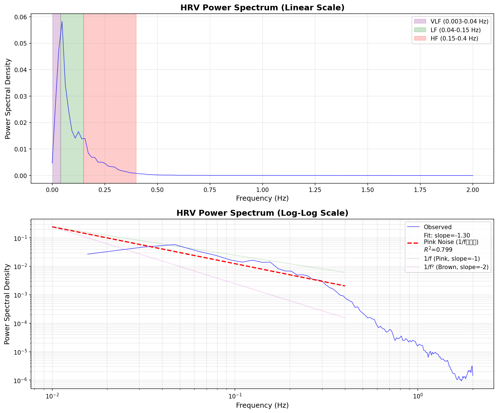

# 1/fゆらぎ検証レポート

**生成日時**: 2026-01-16 19:47:23
**データファイル**: selfloops_2026-01-16--07-18-39.csv

---

## 解析結果サマリー

**結果**: あなたのHRVは **1/fゆらぎ（ピンクノイズ）** の特性を示しています。

1/fゆらぎは自然界に広く見られる理想的なゆらぎパターンで、以下のような特徴があります：
- 心拍変動が適度に予測可能で、かつ適度にランダム
- 自律神経系が柔軟に機能している証拠
- ストレス対応能力が高い状態

---

## パワースペクトル解析

### 傾き（Slope）

| Metric | Value | Unit |
|--------|-------|------|
| Slope | -1.298 | - |
| Correlation (R) | -0.894 | - |
| R² | 0.799 | - |
| P-value | 1.73e-09 | - |
| Frequency Range | 0.01-0.4 | Hz |

### ノイズ分類

**Pink Noise (1/fゆらぎ)**

---

## HRVデータ統計

| Metric | Value | Unit |
|--------|-------|------|
| Data Points | 2181 | samples |
| Mean RR | 919.1 | ms |
| Std RR | 155.1 | ms |
| Min RR | 379.0 | ms |
| Max RR | 1181.0 | ms |
| Duration | 2004.6 | sec |

---

## パワースペクトル図

---

## 参考: ノイズタイプ分類

| Noise Type | Slope Range | Characteristics |
|------------|-------------|-----------------|
| White Noise | > -0.5 | 無相関、完全ランダム |
| **Pink Noise (1/f)** | **-1.5 to -0.5** | **理想的なゆらぎ** |
| Brown Noise | -2.5 to -1.5 | 強相関、規則的 |
| Black Noise | < -2.5 | 非常に強い相関 |

---

## 備考

- パワースペクトルはWelch法で計算されています
- 解析周波数範囲: 0.01-0.4 Hz
- リサンプリング周波数: 4.0 Hz
