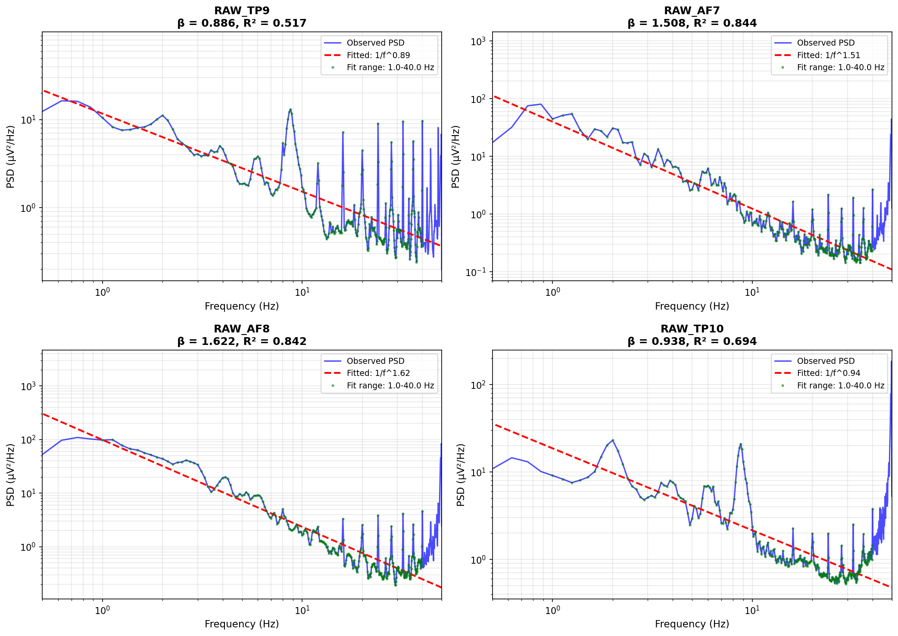

# 1/f Noise Analysis Report

## Overview

This report analyzes the 1/f^β power spectral characteristics of EEG data.

According to prior research:
- Waking state: β ≈ 1.99 (similar to pink noise)
- REM sleep: β ≈ 3.08
- NonREM sleep: β ≈ 2.58

## Summary Statistics

| Channel   |   β (Exponent) |   Amplitude |    R² |
|:----------|---------------:|------------:|------:|
| RAW_TP9   |          0.886 |      11.689 | 0.517 |
| RAW_AF7   |          1.508 |      39.662 | 0.844 |
| RAW_AF8   |          1.622 |      98.412 | 0.842 |
| RAW_TP10  |          0.938 |      18.635 | 0.694 |

**Mean β across channels**: 1.239 ± 0.330

## Interpretation

β値が覚醒時の標準値（2.0）より低く（β = 1.24）、より活発な脳活動の可能性があります。 チャネル間でβ値にばらつきがあります（SD = 0.330）。

## 1/f Noise Fitting

## Technical Details

### Fitting Method

- Model: PSD(f) = A / f^β
- Method: Linear regression in log-log space
- Frequency range: 1.0 - 40.0 Hz
- R²: Coefficient of determination (goodness of fit)

### Data Information

- Data shape: 460956 rows × 60 columns
- Duration: 30.0 minutes
- Start time: 2026-01-16 07:19:47.391000
- End time: 2026-01-16 07:49:45.957000

