# 瞑想分析レポート
- **生成日時**: 2026-01-24 08:26:03
- **データファイル**: `mindMonitor_2026-01-24--07-41-35_1209401358220294378.csv`
- **記録時間**: 2026-01-24 07:42:35 ~ 2026-01-24 08:13:21
- **計測時間**: 30.8 分
---

## 📡 接続品質

- **総合品質スコア**: 1.35
- **Good品質率**: 66.7%

### チャネル別詳細

| チャネル   |   Good (%) |   Medium (%) |   Bad (%) |   平均品質 |
|:-----------|-----------:|-------------:|----------:|-----------:|
| TP9        |      96.00 |         3.35 |      0.65 |       1.05 |
| AF7        |      88.97 |        10.17 |      0.87 |       1.13 |
| AF8        |      43.80 |        54.26 |      1.93 |       1.60 |
| TP10       |      37.85 |        61.34 |      0.81 |       1.64 |

> **注**: 1.0=Good, 2.0=Medium, 4.0=Bad

## 🧾 生データプレビュー

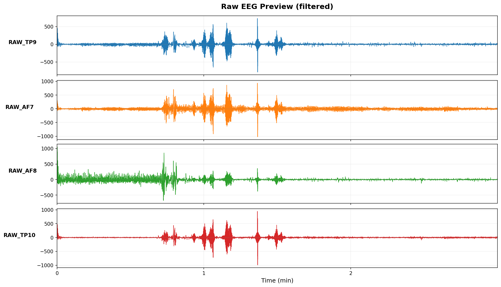

> **注**: フィルタ適用後EEGの初期数分（μV表示）。異常波形の早期チェック用。
## 📊 分析サマリー

### 総合評価

- **総合スコア**: 32.4/100

**スコア内訳**

- 瞑想深度 (Fmθ): 0.0/100
- 集中度 (SE): 50.3/100
- 瞑想深度 (θ/α): 100.0/100
- 覚醒度 (β/α): 0.0/100
- 周波数安定性 (IAF): 8.2/100

### 主要指標サマリー

| 指標 | Mean | Best | 単位 |
|:-----|-----:|-----:|:-----|
| Fmθ | 11.142 | 12.380 | dB |
| IAF | 8.500 | 8.875 | Hz |
| Alpha | 6.382 | 8.606 | dB |
| Beta | 8.602 | 4.462 | dB |
| θ/α | 3.355 | 6.342 | ratio |
| HRV | 34.160 | 43.394 | ms |

### ピークパフォーマンス

- **最高パフォーマンス区間**: 18
- **スコア**: 50.0/100

## 🧠 周波数帯域分析

### バンドパワー時系列

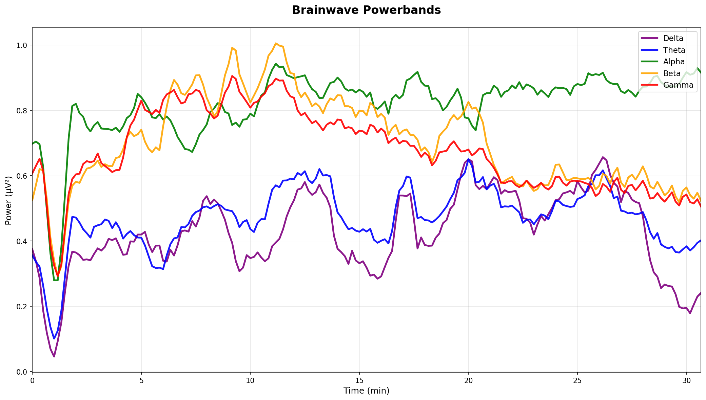

### パワースペクトル密度（PSD）

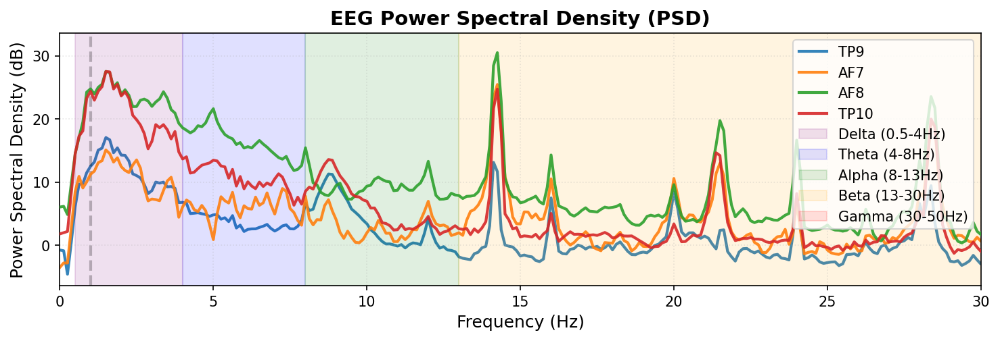

### スペクトログラム

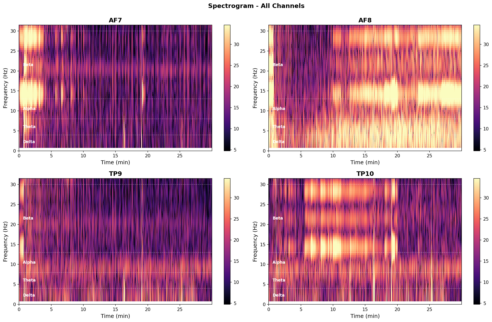

### PSDピーク分析

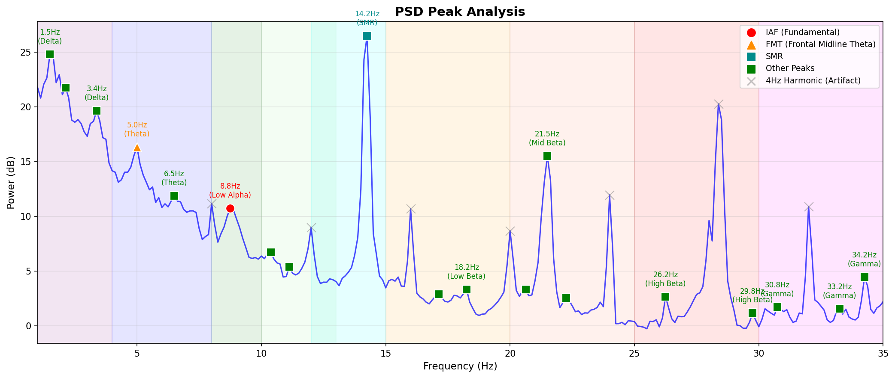

|   周波数 (Hz) |   パワー (dB) | 帯域     | 備考   |
|--------------:|--------------:|:---------|:-------|
|         14.20 |         26.50 | SMR      | SMR    |
|          1.50 |         24.80 | Delta    |        |
|          2.10 |         21.80 | Delta    |        |
|          3.40 |         19.60 | Delta    |        |
|          5.00 |         16.30 | Theta    | FMT    |
|         21.50 |         15.50 | Mid Beta |        |
|         42.60 |         13.30 | Gamma    |        |
|          6.50 |         11.90 | Theta    |        |

> **帯域の説明**:
> - **IAF**: Individual Alpha Frequency（個人のアルファ波ピーク周波数）
> - **FMT**: Frontal Midline Theta（前頭部中心線シータ、4-8Hz）、瞑想深度に関連
> - **SMR**: 感覚運動リズム（12-15Hz）、身体の静止と落ち着きに関連
>
> **注意**: 4Hzの整数倍（4, 8, 12, 16, 20, 24, 28, 32 Hz等）はMuse/Mind Monitor由来の
> アーチファクトの可能性があるため、テーブルから除外しています（グラフではグレーの×印で表示）。
## 🎯 特徴的指標分析

### Frontal Midline Theta (Fmθ)

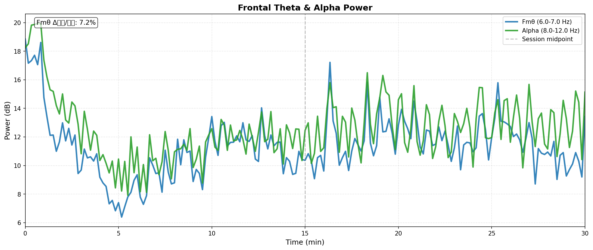

| Metric           |   Value |
|:-----------------|--------:|
| Mean             |  11.339 |
| Median           |  11.301 |
| Std Dev          |   2.117 |
| First Half Mean  |  10.945 |
| Second Half Mean |  11.738 |
| Change (2nd-1st) |   0.792 |

> 単位: dB (10×log₁₀(μV²))

セッション後半の平均Fmθは前半比で **+7.2%** 変化しました。

### SMR-band Power (AF)

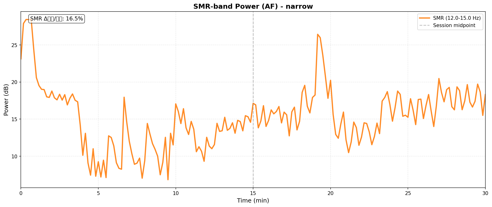

| Metric           |   Value |
|:-----------------|--------:|
| Mean             |  15.257 |
| Median           |  15.252 |
| Std Dev          |   4.150 |
| First Half Mean  |  14.097 |
| Second Half Mean |  16.429 |
| Change (2nd-1st) |   2.332 |

> 単位: dB (10×log₁₀(μV²))

セッション後半の平均SMRは前半比で **+16.5%** 変化しました。

> **解釈**: SMR帯域（12-15Hz）は身体の静止と穏やかな集中に関連します。
> - 増加: 身体静止・運動抑制・集中状態
> - 注意: AF領域での測定のため、本来のSMR（C3/C4）の代替指標として扱います。

### Individual Alpha Frequency (IAF)

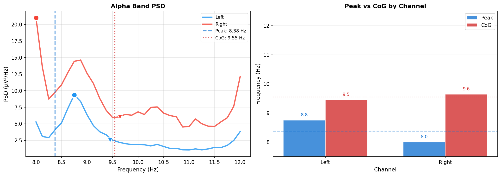

**IAF (Peak)**: 8.38 Hz / **IAF (CoG)**: 9.55 Hz

**チャネル別詳細**

| チャネル   |   Peak (Hz) |   CoG (Hz) |   Power (μV²/Hz) |
|:-----------|------------:|-----------:|-----------------:|
| Left       |        8.75 |       9.45 |             9.34 |
| Right      |        8.00 |       9.64 |            21.02 |

### Alpha Power (Brain Recharge Score)

**Brain Recharge Score**: 78.2 dBx

**Alpha Power**: 8.14 dB

| Metric      |   Value |
|:------------|--------:|
| Score       |   78.15 |
| Alpha Power |    8.14 |
| Score Min   |   36.90 |
| Score Max   |   87.96 |
| Score Std   |    7.16 |

> **解釈**: Brain Recharge ScoreはAlpha波パワーに基づく精神的回復度の指標です。高い値はリラックス・回復状態を示唆します。
> 単位: Score=dBx, Alpha Power=dB

### Frontal Alpha Asymmetry (FAA)

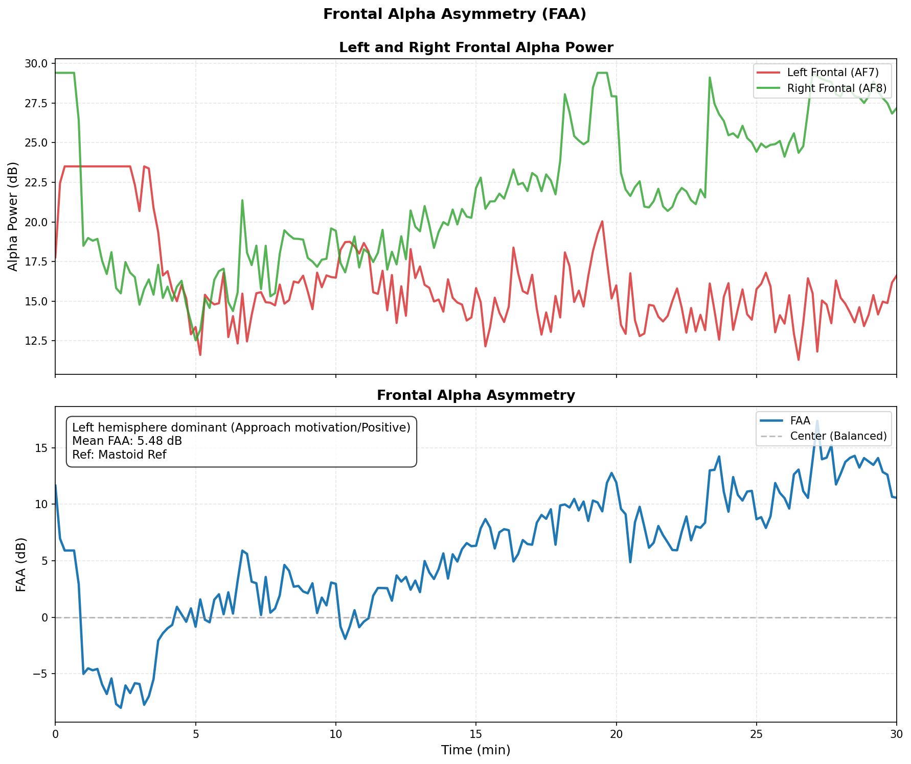

| Metric           | Value                                                   | Unit   |
|:-----------------|:--------------------------------------------------------|:-------|
| Mean FAA         | 5.48296103727586                                        | dB     |
| Median           | 6.030607754702672                                       | dB     |
| Std Dev          | 5.689778279141311                                       | dB     |
| First Half Mean  | 0.9867237361519151                                      | dB     |
| Second Half Mean | 10.029156530634516                                      | dB     |
| Interpretation   | Left hemisphere dominant (Approach motivation/Positive) |        |

> **解釈**: FAA = 10×log₁₀(右Alpha) - 10×log₁₀(左Alpha) [dB単位]。
> Alpha波パワーは脳活動と逆相関（パワー↑=活動↓）するため、
> 正値（右Alpha > 左Alpha）は左半球優位（接近動機・ポジティブ感情）、
> 負値（左Alpha > 右Alpha）は右半球優位（回避動機・ネガティブ感情）を示唆します。

### Spectral Entropy (SE)

| Metric                |   Value | Unit       |
|:----------------------|--------:|:-----------|
| Mean                  |   0.849 | normalized |
| Median                |   0.861 | normalized |
| Std Dev               |   0.081 | normalized |
| First Half Mean       |   0.865 | normalized |
| Second Half Mean      |   0.833 | normalized |
| Change Rate (2nd/1st) |  -3.766 | %          |

セッション後半のエントロピーは前半比で -3.8% 変化しました。
**解釈**: 低下（注意集中）

> **解釈**: Spectral Entropyは周波数成分の多様性を示します。低い値は特定の周波数帯に集中（集中状態）、高い値は広帯域に分散（散漫状態）を示唆します。

### バンド比率指標

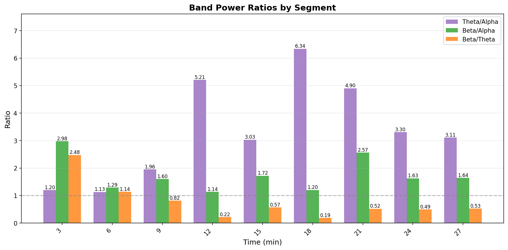

> **指標の解釈**:
> - **θ/α (Theta/Alpha)**: 瞑想深度。値が高いほど深い瞑想状態（内的集中）を示唆
> - **β/α (Beta/Alpha)**: 覚醒度。値が低いほどリラックス状態、高いほど覚醒・緊張状態
> - **β/θ (Beta/Theta)**: 注意・集中度。値が高いほど外的タスクへの集中を示唆

## 🩸 血流動態分析 (fNIRS)

### HbO/HbR時系列

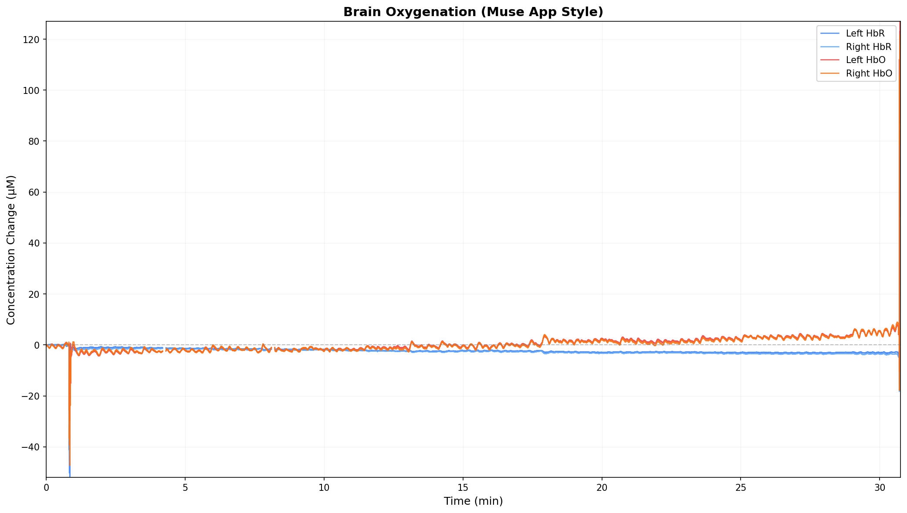

### 統計サマリー

|        |   HbO平均 |   HbO最小 |   HbO最大 |   HbR平均 |   HbR最小 |   HbR最大 |   HbT平均 |   HbD平均 |
|:-------|----------:|----------:|----------:|----------:|----------:|----------:|----------:|----------:|
| 左半球 |      0.51 |    -29.42 |    126.88 |     -2.15 |    -51.75 |     74.23 |     -1.64 |      2.66 |
| 右半球 |      0.30 |    -47.33 |    121.75 |     -2.46 |    -45.96 |     84.43 |     -2.16 |      2.75 |

> **指標の説明**:
> - **HbO**: 酸素化ヘモグロビン（脳活動で増加）
> - **HbR**: 脱酸素化ヘモグロビン（脳活動で減少）
> - **HbT**: 総ヘモグロビン (HbO + HbR)、総血液量の変化を示す
> - **HbD**: ヘモグロビン差分 (HbO - HbR)、酸素化の程度を示す

### Laterality Index (左右差)

| 指標 | 値 | 解釈 |
|:-----|---:|:-----|
| LI (HbO) | -0.264 | 左半球優位 |
| LI (HbD) | 0.018 | 均衡 |

> **LI (Laterality Index)**: LI = (右 - 左) / (右 + 左)。範囲は-1～+1で、正値は右半球優位、負値は左半球優位を示します。

## 🫀 自律神経系分析(ECG)

### 時間領域解析

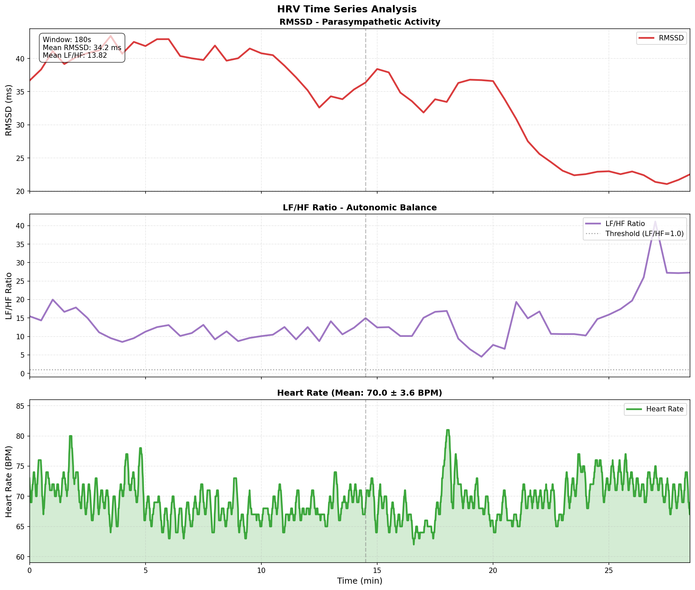

> **時系列の見方**:
> - **RMSSD**: 副交感神経活動の指標。高いほどリラックス状態。
> - **LF/HF Ratio**: 自律神経バランス。1.0未満は副交感神経優位（リラックス）、1.0以上は交感神経優位（緊張）。

### 周波数領域解析

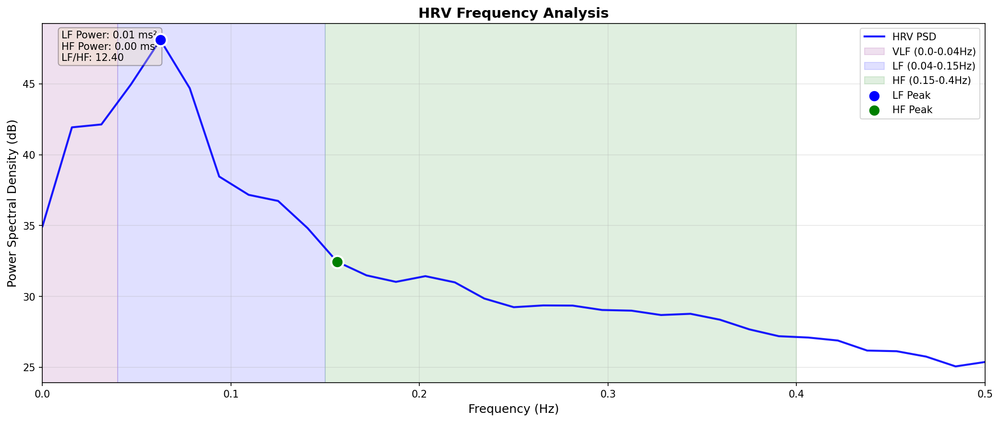

> **周波数帯域の説明**:
> - **VLF (0.0-0.04 Hz)**: Very Low Frequency - 長期的な調節機構
> - **LF (0.04-0.15 Hz)**: Low Frequency - 交感神経＋副交感神経活動（圧受容体反射）
> - **HF (0.15-0.4 Hz)**: High Frequency - 副交感神経活動（呼吸性洞性不整脈）

### 統計指標

#### Time Domain

| Metric   |   Value | Unit   |
|:---------|--------:|:-------|
| SDNN     |   63.39 | ms     |
| RMSSD    |   34.45 | ms     |
| pNN50    |   13.78 | %      |
| MeanNN   |  871.36 | ms     |
| MedianNN |  873.00 | ms     |
| CVNN     |    0.07 | %      |
| SDSD     |   34.46 | ms     |

#### Frequency Domain

| Metric           |   Value | Unit   |
|:-----------------|--------:|:-------|
| VLF              |    0.00 | ms²    |
| LF               |    0.01 | ms²    |
| LF Peak          |    0.06 | Hz     |
| HF               |    0.00 | ms²    |
| HF Peak          |    0.16 | Hz     |
| LF/HF            |   12.40 | -      |
| Total Power      |    0.01 | ms²    |
| 1/f β (Exponent) |    1.80 | -      |

> **指標の説明**:
> - **時間領域（Time Domain）**: R-R間隔の変動を時間で評価。SDNN/RMSSDが高いほど心拍変動が大きく、リラックス状態。
> - **周波数領域（Frequency Domain）**: 心拍変動を周波数解析。HFは副交感神経、LFは交感神経＋副交感神経の混合。
> - **非線形（Nonlinear）**: Poincaréプロットによる複雑性評価。SD1は短期変動、SD2は長期変動。
>
> **⚠️ LF/HF比の解釈について**: 呼吸数が4.2回/分と非常に遅いため、呼吸性変動がLF帯域（2.4-9回/分）に集中しています。この場合、LF/HF比の従来解釈（>2.5=交感神経優位）は**適用できません**。むしろ深い瞑想状態を示唆しています。

### 呼吸指標

| Metric                    |   Value | Unit   |
|:--------------------------|--------:|:-------|
| Mean Breathing Rate       |     4.2 | bpm    |
| Respiratory Period        |    14.3 | s      |
| Breathing Rate (Std)      |     1.2 | bpm    |
| Breathing Rate (Spectral) |     9.4 | bpm    |
| Peak Count                |   129.0 | count  |
| Trough Count              |   129.0 | count  |

#### 共鳴呼吸回数（Resonance Breathing Pace）

| BR Range   |   BR Center (bpm) |   Count |   RMSSD Mean (ms) |   RMSSD Std (ms) |   LF Power Mean (ms^2) |   LF Power Std (ms^2) |
|:-----------|------------------:|--------:|------------------:|-----------------:|-----------------------:|----------------------:|
| 3.0-3.5    |              3.25 |       2 |             26.72 |             5.88 |                1718.54 |                514.87 |
| 3.5-4.0    |              3.75 |       3 |             31.08 |             8.75 |                2459.85 |                178.34 |
| 4.0-4.5    |              4.25 |       1 |             35.19 |           nan    |                2175.90 |                nan    |
| 4.5-5.0    |              4.75 |       5 |             37.08 |             7.36 |                2381.66 |                588.44 |

> **共鳴呼吸（Resonance Breathing）**: 呼吸のペースと心拍の周期が共鳴し、HRV（特にRMSSD）が最大化される呼吸回数。通常4.5-6.5回/分が最適値。

## 🏃 姿勢・体動分析（IMU）

### 体動・心拍数時系列

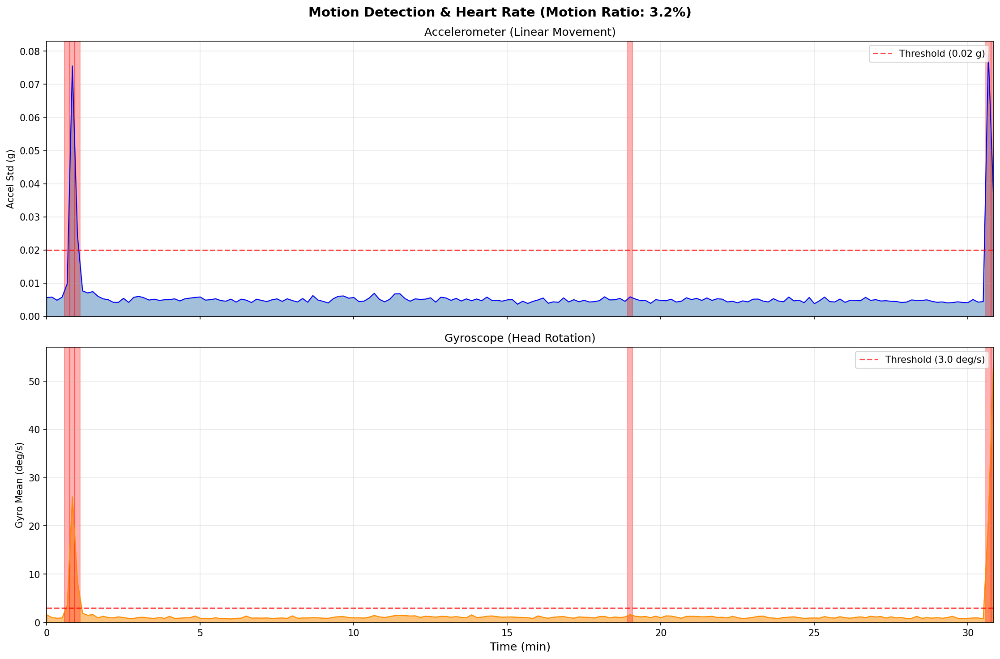

> **グラフの見方**:
> - **Motion Index**: 重力成分除去後の純粋な動き（小さいほど静止）
> - **Gyro RMS**: 頭部回転の総合指標（小さいほど安定）
> - **Heart Rate**: 心拍数（BPM）

### サマリー統計

| Metric         | Value    |
|:---------------|:---------|
| 心拍数（平均） | 70.0 BPM |
| 心拍数（最小） | 62.0 BPM |
| 心拍数（最大） | 82.0 BPM |

> **指標の説明**:
> - **平均/最大モーション指数**: 重力成分除去後の純粋な動き（論文ベース、小さいほど静止）
> - **ジャイロRMS**: 頭部回転の総合指標（3軸合成、小さいほど安定）
> - **Pitch RMS**: 前後方向の回転運動（小さいほど安定）
> - **Roll RMS**: 左右方向の回転運動（小さいほど安定）
> - **Yaw RMS**: 水平方向の回転運動（脳波との相関実証済、小さいほど安定）

### 時系列詳細（3分ごと）

|   motion_index_mean |   motion_index_max |   gyro_rms |   gyro_rms_corrected |   pitch_rms |   roll_rms |   yaw_rms |
|--------------------:|-------------------:|-----------:|---------------------:|------------:|-----------:|----------:|
|                0.05 |               0.75 |       2.66 |                 2.66 |        2.15 |       0.71 |      1.40 |
|                0.02 |               0.07 |       1.08 |                 1.04 |        0.79 |       0.42 |      0.60 |
|                0.02 |               0.08 |       1.15 |                 1.11 |        0.83 |       0.42 |      0.67 |
|                0.02 |               0.09 |       1.42 |                 1.40 |        0.96 |       0.53 |      0.91 |
|                0.02 |               0.07 |       1.33 |                 1.30 |        0.84 |       0.48 |      0.92 |
|                0.02 |               0.08 |       1.31 |                 1.27 |        0.80 |       0.49 |      0.91 |
|                0.02 |               0.07 |       1.35 |                 1.31 |        0.80 |       0.55 |      0.93 |
|                0.02 |               0.06 |       1.17 |                 1.14 |        0.71 |       0.47 |      0.81 |
|                0.02 |               0.07 |       1.20 |                 1.17 |        0.74 |       0.46 |      0.83 |

## ⏱️ 時間経過分析

### セグメント別パフォーマンス

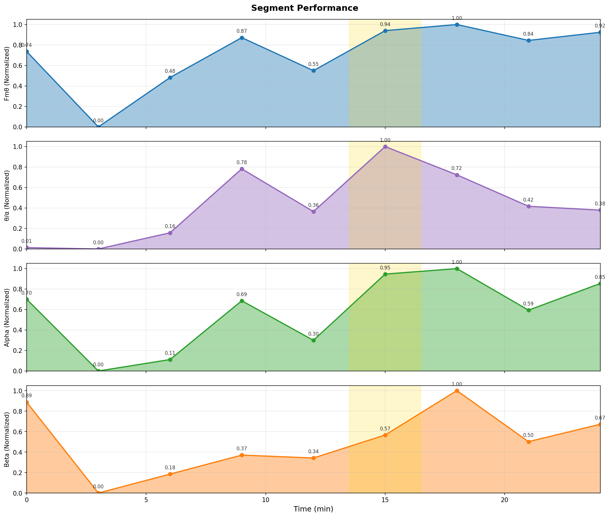

### バンドパワー詳細

|   min |   δ (dB) |   θ (dB) |   α (dB) |   β (dB) |   γ (dB) |   δ (%) |   θ (%) |   α (%) |   β (%) |   γ (%) |
|------:|---------:|---------:|---------:|---------:|---------:|--------:|--------:|--------:|--------:|--------:|
|  3.00 |     9.36 |     7.83 |     7.03 |    11.77 |    21.73 |    4.70 |    3.30 |    2.75 |    8.17 |   81.08 |
|  6.00 |     7.32 |     3.89 |     3.35 |     4.46 |     5.24 |   33.44 |   15.17 |   13.38 |   17.30 |   20.71 |
|  9.00 |    10.17 |     6.85 |     3.94 |     5.99 |     6.88 |   39.16 |   18.22 |    9.32 |   14.93 |   18.37 |
| 12.00 |    21.95 |    14.12 |     6.95 |     7.51 |    11.78 |   75.27 |   12.41 |    2.38 |    2.71 |    7.23 |
| 15.00 |    13.68 |     9.74 |     4.92 |     7.28 |    14.48 |   33.68 |   13.62 |    4.49 |    7.72 |   40.49 |
| 18.00 |    28.00 |    16.35 |     8.32 |     9.13 |    16.06 |   86.49 |    5.92 |    0.93 |    1.12 |    5.54 |
| 21.00 |    26.32 |    15.51 |     8.61 |    12.70 |    15.61 |   81.41 |    6.76 |    1.38 |    3.54 |    6.92 |
| 24.00 |    14.68 |    11.66 |     6.47 |     8.59 |     9.12 |   45.97 |   22.96 |    6.95 |   11.32 |   12.80 |
| 27.00 |    19.40 |    12.76 |     7.84 |     9.99 |     9.05 |   66.93 |   14.54 |    4.68 |    7.68 |    6.18 |

> **注**: min = 経過時間（分）、dB = 絶対パワー、% = 相対パワー（全バンド合計に対する割合）

### 比率と特徴指標

|   min |   θ/α |   β/α |   β/θ |   Fmθ (dB) |   FMT/α |   SMR (dB) |   SE |   IAF (Hz) |   HbO |   HbR |    HR |   HRV |   RP (s) |   Yaw RMS | 備考            |
|------:|------:|------:|------:|-----------:|--------:|-----------:|-----:|-----------:|------:|------:|------:|------:|---------:|----------:|:----------------|
|     3 |  1.20 |  2.98 |  2.48 |      11.27 |    2.65 |      17.89 | 0.78 |       8.50 | -2.33 | -1.31 | 70.96 | 40.98 |    12.88 |      1.40 | relaxing        |
|     6 |  1.13 |  1.29 |  1.14 |       8.17 |    3.04 |      10.44 | 0.81 |       8.75 | -2.25 | -1.42 | 69.23 | 41.88 |    12.42 |      0.60 |                 |
|     9 |  1.96 |  1.60 |  0.82 |      10.20 |    4.23 |      10.68 | 0.76 |       8.75 | -1.74 | -1.73 | 67.64 | 40.49 |    13.23 |      0.67 |                 |
|    12 |  5.21 |  1.14 |  0.22 |      11.84 |    3.08 |      12.86 | 0.71 |       8.88 | -1.59 | -2.04 | 67.61 | 37.52 |    13.29 |      0.91 |                 |
|    15 |  3.03 |  1.72 |  0.57 |      10.49 |    3.60 |      14.82 | 0.77 |       8.00 | -0.70 | -2.49 | 68.91 | 36.03 |    13.36 |      0.92 |                 |
|    18 |  6.34 |  1.20 |  0.19 |      12.13 |    2.40 |      16.18 | 0.61 |       8.75 | -0.07 | -2.50 | 68.35 | 33.98 |    15.21 |      0.91 | peak            |
|    21 |  4.90 |  2.57 |  0.52 |      12.38 |    2.38 |      16.30 | 0.62 |       8.00 |  1.55 | -2.96 | 68.15 | 33.73 |    15.16 |      0.93 |                 |
|    24 |  3.30 |  1.63 |  0.49 |      11.73 |    3.35 |      15.53 | 0.78 |       8.00 |  1.44 | -2.98 | 70.66 | 23.49 |    17.66 |      0.81 |                 |
|    27 |  3.11 |  1.64 |  0.53 |      12.06 |    2.64 |      17.13 | 0.74 |       8.88 |  2.77 | -3.22 | 72.38 | 22.23 |    17.16 |      0.83 | post meditation |

