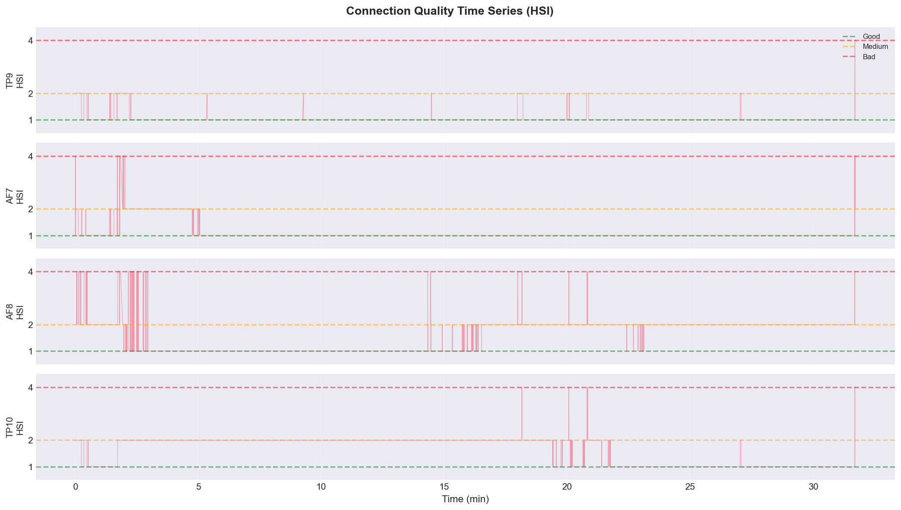
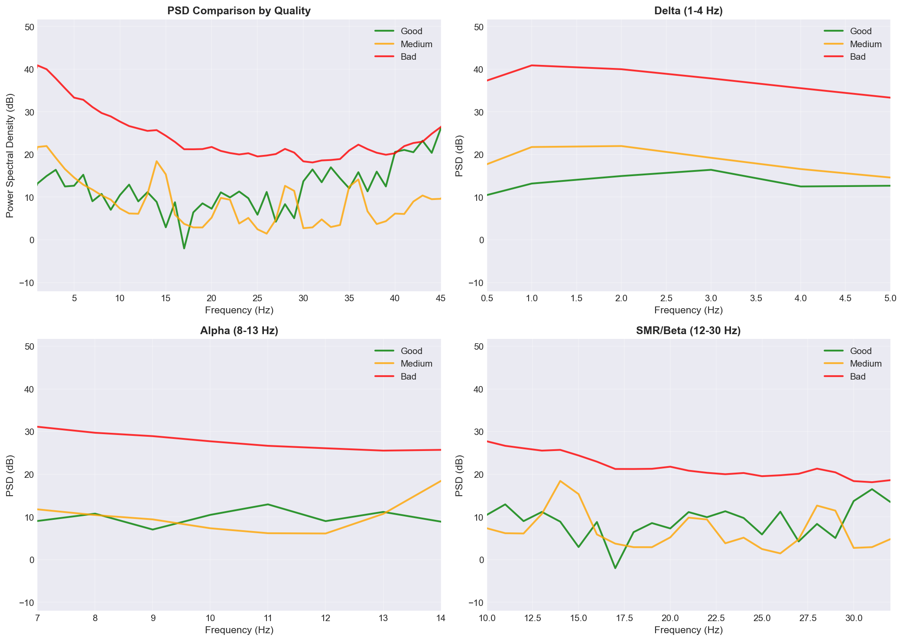
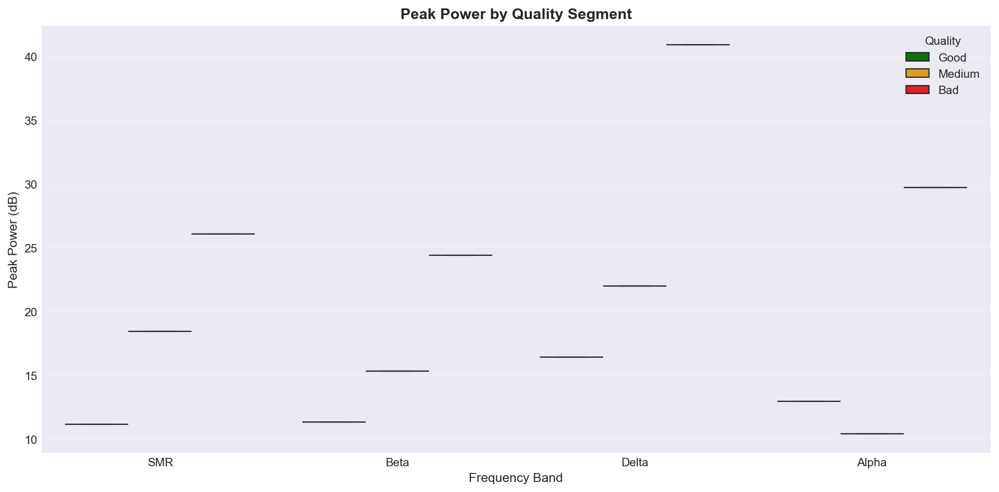
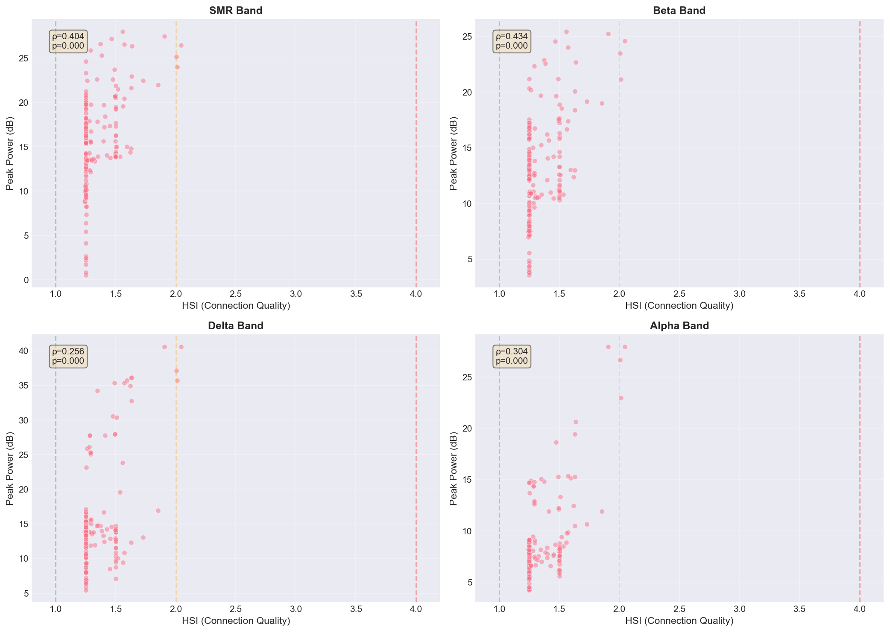

# 接続品質と脳波パターンの関係分析レポート

**生成日時**: 2026-01-24 08:33:49

---

## 1. データ概要

### 品質セグメント分布

| Quality | Samples | Percentage | Duration (s) |
|---------|---------|------------|--------------|
| Good | 364 | 0.1% | 1.4 |
| Medium | 471312 | 97.5% | 1841.1 |
| Bad | 11603 | 2.4% | 45.3 |

---

## 2. 可視化結果

### 品質セグメント時系列

### 品質別PSD比較

### 品質別ピークパワー箱ひげ図

### HSI値とバンドパワーの散布図

---

## 3. ピークパワー詳細

### Good Quality

| Band | Peak Power (dB) |
|------|----------------|
| SMR | 11.16 |
| Beta | 11.32 |
| Delta | 16.40 |
| Theta | 15.25 |
| Alpha | 12.93 |

### Medium Quality

| Band | Peak Power (dB) |
|------|----------------|
| SMR | 18.42 |
| Beta | 15.34 |
| Delta | 21.98 |
| Theta | 16.59 |
| Alpha | 10.42 |

### Bad Quality

| Band | Peak Power (dB) |
|------|----------------|
| SMR | 26.09 |
| Beta | 24.40 |
| Delta | 40.89 |
| Theta | 35.54 |
| Alpha | 29.72 |

---

## 4. 結論

### PAF（ピークアルファ周波数）

- PAFは接続品質に依存せず、真の脳活動を反映していると考えられる

### SMR/Beta/Deltaのピーク

- 接続品質との相関が観察された場合は、アーティファクトの可能性が高い
- Good品質セグメントでも明確に現れるパターンは、真の脳活動と判断できる

### 推奨事項

- 分析時は接続品質（HSI）を考慮し、Good品質データを優先的に使用する
- Medium/Bad品質データは参考程度にとどめる
