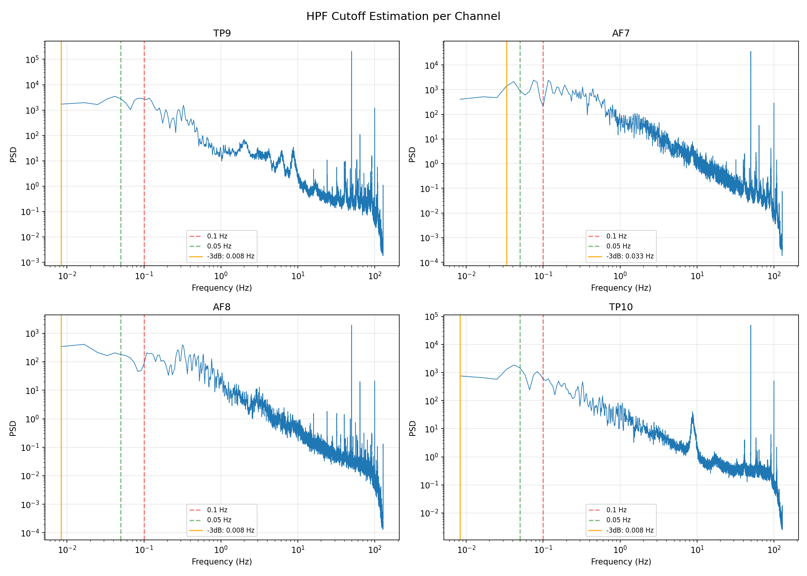
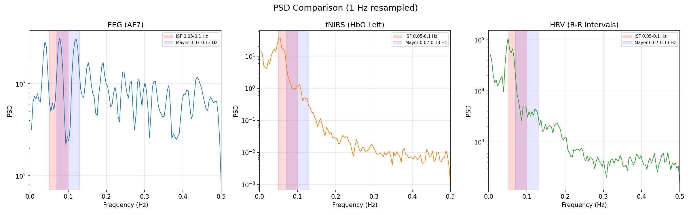
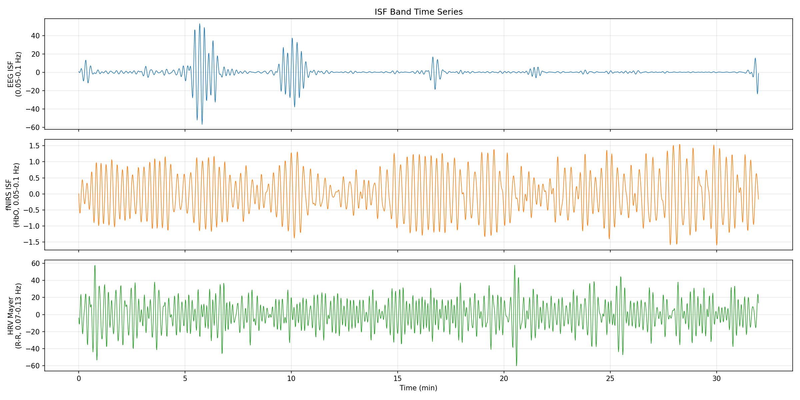
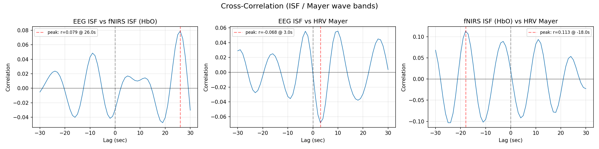
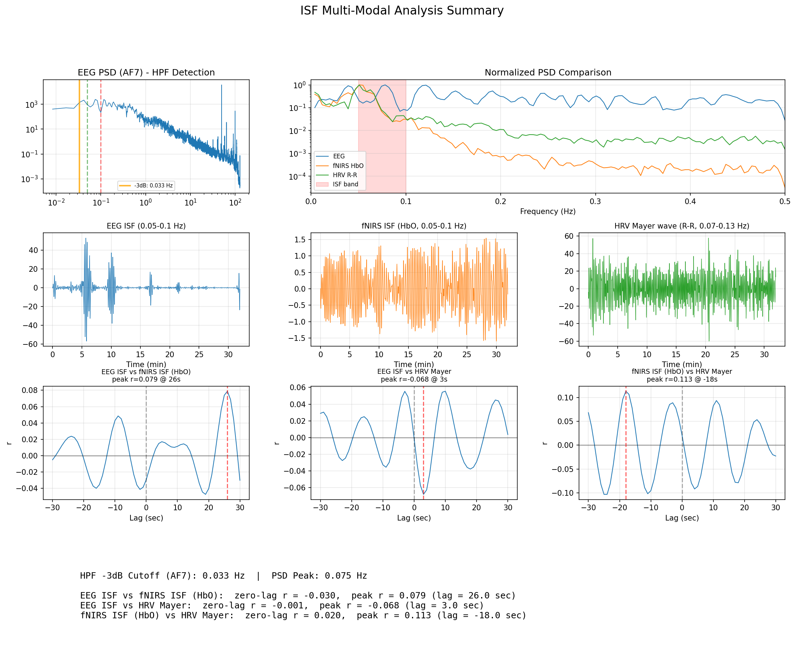

# ISF (Infra-Slow Fluctuation) マルチモーダル解析

## 目的

Muse S の RAW EEG から ISF（< 0.1 Hz）が抽出可能かを検証し、
同時記録の fNIRS・HRV Mayer波との相互相関を分析する。

## データ

### Session 1 (2026-02-06)

| Source | File | Duration |
|--------|------|----------|
| EEG (Muse S) | `mindMonitor_2026-02-06--07-42-47_*.csv` | 32.0 min |
| fNIRS (Muse S Optics) | 同上 (Optics1-4) | 同上 |
| HRV (Selfloops ECG) | `selfloops_2026-02-06--07-42-47.csv` | 同セッション |

### Session 2 (2026-01-29)

| Source | File | Duration |
|--------|------|----------|
| EEG (Muse S) | `mindMonitor_2026-01-29--06-21-09_*.csv` | 30.2 min |
| fNIRS (Muse S Optics) | 同上 (Optics1-4) | 同上 |
| HRV (Selfloops ECG) | `selfloops_2026-01-29--06-21-08.csv` | 同セッション |

## 結果

### 1. HPF カットオフ推定

Muse S の RAW EEG には内蔵ハイパスフィルタ (HPF) が存在する。

| Channel | PSD Peak (Hz) | -3dB Cutoff (Hz) |
|---------|--------------|-------------------|
| AF7 | 0.075 | 0.033 |
| AF8 | 0.017 | 0.008 |
| TP9 | 0.042 | 0.008 |
| TP10 | 0.042 | 0.008 |

- AF7 のカットオフが他チャンネルより高い（0.033 Hz）
- TP9/TP10/AF8 は 0.008 Hz 付近で、ISF帯域へのアクセスが比較的良好
- **0.05-0.1 Hz（ISF上位帯域）は全チャンネルで利用可能**



### 2. PSD 比較

3モダリティのPSDを正規化して比較。



- **EEG**: 0.05 Hz 以上に 1/f パワーあり。HPF による低域減衰が明確
- **fNIRS (HbO)**: ISF帯域に強いパワーを持つ。0.05-0.1 Hz に明確なエネルギーあり
- **HRV (R-R)**: 0.1 Hz 付近に Mayer wave のパワーが顕著

### 3. ISF 帯域の時系列



- EEG ISF: セッション前半に大きな変動、後半は安定
- fNIRS ISF: セッション全体を通して活発な揺らぎ
- HRV Mayer wave: 比較的安定した振幅の周期的変動

### 4. 相互相関解析



| Pair | Zero-lag r | Peak r | Peak Lag (sec) |
|------|-----------|--------|----------------|
| EEG ISF vs fNIRS ISF (HbO) | -0.030 | 0.079 | +26.0 |
| EEG ISF vs HRV Mayer | -0.001 | -0.068 | +3.0 |
| fNIRS ISF (HbO) vs HRV Mayer | 0.020 | 0.113 | -18.0 |

すべてのペアで **相関は非常に弱い**（|r| < 0.12）。

### 5. Session 2 (2026-01-29) での再現検証

別日のデータで同じ解析を実施し、再現性を確認した。

**HPF カットオフ:**

| Channel | PSD Peak (Hz) | -3dB Cutoff (Hz) |
|---------|--------------|-------------------|
| AF7 | 0.083 | 0.058 |
| AF8 | 0.175 | 0.142 |
| TP9 | 0.083 | 0.058 |
| TP10 | 0.383 | 0.358 |

Session 1 と比較して **全体的にカットオフが高い**。特に TP10 は 0.358 Hz とISF帯域自体が使えないレベル。
HPFカットオフは**セッション間で安定しない**（電極接触状態に依存と推測）。

**相互相関:**

| Pair | Zero-lag r | Peak r | Peak Lag (sec) |
|------|-----------|--------|----------------|
| EEG ISF vs fNIRS ISF (HbO) | 0.133 | -0.135 | -7.0 |
| EEG ISF vs HRV Mayer | -0.082 | 0.115 | -19.0 |
| fNIRS ISF (HbO) vs HRV Mayer | -0.004 | -0.083 | +26.0 |

Session 1 と同様に **すべてのペアで相関は弱い**（|r| < 0.14）。
ラグの方向・大きさもセッション間で一貫性がなく、系統的な信号ではなくノイズである可能性が高い。

### 6. 2セッション比較まとめ

| Pair | Session 1 peak r | Session 2 peak r |
|------|-----------------|-----------------|
| EEG vs fNIRS | 0.079 | -0.135 |
| EEG vs HRV | -0.068 | 0.115 |
| fNIRS vs HRV | 0.113 | -0.083 |

- **符号すら一致しない** → 再現性なし
- ピークラグも大きく異なる → 生理学的に一貫した遅延がない

### 7. サマリー図



## 考察

### ISF 抽出の可能性

- Muse S の HPF カットオフは **チャンネル依存かつセッション依存**
  - Session 1: AF7=0.033 Hz, TP9/TP10=0.008 Hz
  - Session 2: AF7=0.058 Hz, TP10=0.358 Hz（ISF帯域外）
- HPFカットオフが安定しないため、ISF帯域の信頼性は低い
- < 0.03 Hz のISFは HPF で除去されている

### クロスモーダル相関が弱い理由

1. **空間的不一致**: EEG (AF7=前頭葉) と fNIRS (Optics=前頭葉) は近いが、HRV は心臓由来で直接的な空間対応がない
2. **fNIRS の時間分解能不足**: Optics データの更新レートが ~4% のサンプルのみ（256 Hz 中約 10 Hz）。ISF帯域のナイキスト条件は満たすが、位相情報の精度が低い
3. **ISF帯域でのSNR**: ドライ電極の Muse では電極ドリフト・発汗アーティファクトが ISF帯域と重なり、神経信号との分離が困難
4. **Neurovascular coupling lag**: fNIRS の血行動態応答は EEG に対して 5-8 秒の遅延が期待されるが、r=0.079@lag=26s は生理学的に説明困難

### 結論

**Muse S の ISF 帯域は実用的な解析対象として不適切。**

- 2セッションで検証し、EEG-fNIRS-HRV 間に **再現性のある ISF 帯域相関は検出されなかった**
- 相関の符号すらセッション間で反転しており、ノイズと判断
- HPF カットオフがセッション間で不安定（電極接触状態に依存）
- Muse S の強みは **1-50 Hz の従来型 EEG バンド解析** にある

## スクリプト

```bash
source venv/bin/activate
python issues/018_isf/analyze_isf.py
```
