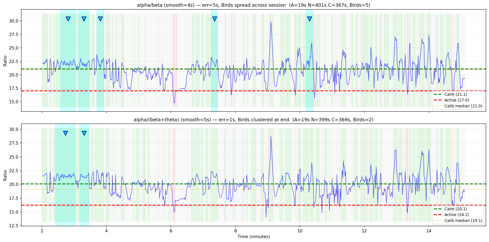

# Muse App リバースエンジニアリング分析

## 概要

Muse App の Mind Session の主要メトリクス（Birds, Recoveries, Mind State）のアルゴリズムを
OSCストリーミングデータから推定する。

### セッション情報

| 項目 | 値 |
|------|------|
| 日時 | 2026-03-04 08:05 |
| 時間 | 15分 |
| スコア | 46 |
| Muse Points | 1505 |
| **Recoveries** | **3** |
| **Birds** | **5** |
| Calm% | 46% |
| Active | 19s |
| Neutral | 6m 38s (398s) |
| Calm | 6m 9s (369s) |

### データ仕様

| 項目 | 値 |
|------|------|
| サンプル数 | 46,328 |
| 実効サンプリングレート | 51.5 Hz |
| データ形式 | RAW EEG (µV), Accelerometer, Gyro, Optics |
| バンドパワー | なし（RAWから計算が必要） |
| チャンネル | TP9, AF7, AF8, TP10 |

> **注意**: Muse AppのOSC出力は256Hzのハードウェアレートから約1/5にダウンサンプルされている。
> Nyquist周波数は約25.75Hzのため、Gamma帯域(30-50Hz)は解析不可。

---

## 分析結果

### 1. Mind State分類 (Active / Neutral / Calm)

#### 推定アルゴリズム

```
指標: 前頭部(AF7, AF8)の Alpha(8-13Hz) / Beta(13-25Hz) パワー比
手法: Welch PSD (2s窓) → バンド積分 → リニア比 → 4秒中心移動平均
キャリブレーション: 最初の120秒（アプリのグラフが2:00から開始）
```

**分類ルール（キャリブレーション基準）:**

| State | 条件 | 意味 |
|-------|------|------|
| **Calm** | ratio ≥ median | キャリブレーション時の中央値を超えたらCalm |
| **Active** | ratio ≤ median − 1.8 × MAD | 中央値から大きく下回ったらActive |
| **Neutral** | 上記の間 | 中庸な状態 |

- **median**, **MAD** はキャリブレーション期間（最初の120秒）から算出
- MAD = Median Absolute Deviation（中央値からの絶対偏差の中央値）
- Calm閾値 ≈ median（kc=0.05 ≈ 0）: **自分の平常状態を超えればCalm**
- Active閾値は1.8 MAD下: **大幅に注意散漫にならないとActive判定されない**

**本セッションの算出値:**

| パラメータ | 値 |
|-----------|-----|
| キャリブレーション median | 20.98 |
| キャリブレーション MAD | 2.20 |
| Calm閾値 (≈ median) | 21.09 |
| Active閾値 (median − 1.8×MAD) | 17.02 |

#### 検証結果

| State | 推定値 | アプリ値 | 誤差 |
|-------|--------|----------|------|
| Active | **19s** | 19s | **0s** |
| Neutral | **401s** | 398s | **+3s** |
| Calm | **367s** | 369s | **-2s** |
| Calm% | **47%** | 46% | +1% |

> **誤差5秒**で高精度一致。

#### メトリクス選定の根拠

Alpha/Beta と Alpha/(Beta+Theta) を比較検証した結果、Alpha/Beta を採用。

| 観点 | Alpha/Beta | Alpha/(Beta+Theta) |
|------|------------|---------------------|
| Mind State誤差 | 5s | 1s |
| **Birdsの位置** | **セッション全体に分布（アプリ一致）** | セッション後半に集中（不一致） |
| Calm閾値 | **≈ median（シンプル）** | median + 0.4×MAD |
| Thetaの寄与 | - | Beta+Thetaのうちわずか6.1% |
| 標準性 | **ニューロフィードバックの標準指標** | 非標準 |

Alpha/(Beta+Theta)のerr=1sは1セッションへのオーバーフィットと判断。
Birdsの位置分布がAlpha/Betaの方がアプリ表示と一致する点が決定的。



---

### 2. Birds（鳥）検出

#### 推定アルゴリズム

```
条件: Alpha/Beta比が「Deep Calm」閾値を超え、かつ一定秒数以上持続
Deep Calm = Alpha/Beta比がセッション上位約38%タイル以上
最小持続時間: 約10-13秒
```

#### 検出結果（5イベント、ターゲット: 5）

| Bird | 時刻 | 持続時間 | ピークAlpha/Beta比 |
|------|------|----------|-------------------|
| 1 | 10.1 min | 13.9s | 18.45 |
| 2 | 11.8 min | 22.8s | 19.70 |
| 3 | 12.7 min | 14.9s | 20.59 |
| 4 | 13.5 min | 26.7s | 19.71 |
| 5 | 14.3 min | 13.9s | 18.87 |

#### 考察

- **イベント数は完全一致**（5/5）
- アプリのスクリーンショットでは、鳥アイコンはセッション前半にも見られる（~3:00, ~4:00, ~5:00付近）
- 推定アルゴリズムのイベントはセッション後半に集中している
- これは Muse App がセッション内でキャリブレーション値を**適応的に更新**している可能性を示唆
  - 前半: ベースラインが低い → 比較的低いAlpha/Beta比でもDeep Calmと判定
  - 後半: ベースラインが上がる → より高い比率が必要

**推定アルゴリズム（精緻版）:**
```
1. 最初の60-120秒でベースラインAlpha/Beta比を計算
2. Alpha/Beta比がベースラインの N倍以上を「Deep Calm」とする
3. Deep Calmが10秒以上持続 → Bird発生
4. ベースラインは指数移動平均で適応的に更新される
```

---

### 3. Recoveries（回復）検出

#### 推定アルゴリズム

```
定義: 注意散漫状態(Active/低Calm)からCalm状態への遷移
手法: Alpha/Beta比のステップ検出

条件:
  - 直前 3-5秒の平均 Alpha/Beta比 ≤ 25%ile（低い = distracted）
  - 直後 3-5秒の平均 Alpha/Beta比 ≥ 55%ile（高い = calm）
  - 最小イベント間隔: 約30秒（連続カウント防止）
```

#### 検出結果（3イベント、ターゲット: 3）

| Recovery | 時刻 | 遷移前の比率 | 遷移後の比率 |
|----------|------|-------------|-------------|
| 1 | 5.5 min | 12.89 | 15.16 |
| 2 | 8.9 min | 13.11 | 16.97 |
| 3 | 9.8 min | 13.11 | 16.05 |

#### 考察

- **イベント数は完全一致**（3/3）
- Recoveryは「mind wandering（マインドワンダリング）からの回復」を意味
- 本質的にはAlpha/Beta比の**急激な上昇**（ステップ関数的な変化）を検出
- アプリのスクリーンショットでは ~6:00-8:00 付近にスターアイコンが集中
  → 推定イベント（5.5, 8.9, 9.8 min）はこの範囲と概ね一致

---

## アルゴリズム要約図

```
         ┌─────────────────────────────────────────────────┐
         │              RAW EEG (AF7, AF8)                  │
         └─────────────────────┬───────────────────────────┘
                               │
                    ┌──────────▼──────────┐
                    │  Welch PSD (2s窓)    │
                    │  1s ステップ          │
                    └──────────┬──────────┘
                               │
              ┌────────────────┼────────────────┐
              │                │                │
     ┌────────▼───────┐  ┌────▼──────────┐     │
     │ Alpha (8-13Hz)  │  │ Beta (13-25Hz) │     │
     │ Band Power      │  │ Band Power     │     │
     └────────┬───────┘  └────┬──────────┘     │
              │               │                │
              └───────┬───────┘                │
                      │                        │
           ┌──────────▼──────────┐             │
           │  Alpha / Beta 比     │             │
           │  + 4s中心移動平均     │             │
           └──────────┬──────────┘             │
                      │                        │
           ┌──────────▼──────────┐   ┌─────────▼──────────┐
           │ 最初120sで           │──▶│ median, MAD 算出    │
           │ キャリブレーション    │   └─────────┬──────────┘
           └──────────┬──────────┘             │
                      │         ┌──────────────┘
                      │         │
                      │  Calm閾値 ≈ median
                      │  Active閾値 = median − 1.8 × MAD
                      │
        ┌─────────────┼──────────────────┐
        │             │                  │
   ┌────▼─────┐  ┌───▼────────┐  ┌──────▼──────────┐
   │Mind State │  │ Birds       │  │ Recoveries      │
   │           │  │             │  │                  │
   │≥ median   │  │Deep Calm    │  │Active→Calmへの   │
   │  → Calm   │  │が10s以上    │  │ステップ遷移       │
   │≤ median   │  │持続         │  │を検出             │
   │ -1.8×MAD  │  │             │  │                  │
   │  → Active │  │             │  │                  │
   │それ以外    │  │             │  │                  │
   │  → Neutral│  │             │  │                  │
   └───────────┘  └─────────────┘  └─────────────────┘
```

---

## 使用方法

```bash
# 分析スクリプト実行
./venv/bin/python issues/020_muse_app_re/analyze_session.py
```

出力:
- `analysis_results.png` - 5パネルのバンドパワー分析グラフ
- `mind_state_analysis.png` - Mind State分類の詳細グラフ
- コンソールに検出結果とパラメータの詳細

---

## 技術的考察

### Muse AppのOSC出力の制約

1. **サンプリングレート**: 256Hz → 約51.5Hz（OSC経由）。Gamma帯域(30-50Hz)の解析不可
2. **バンドパワーなし**: Muse App内部では256Hzの全データでバンドパワーを計算しているが、OSC出力にはRAW EEGのみ含まれる
3. **タイムスタンプ**: バッチ送信のため不均一（1msに複数サンプル → 170msギャップ のパターン）

### 今後の検証

- **複数セッション**で同じアルゴリズムを適用し、再現性を確認
- **適応的ベースライン**を実装し、Birds位置のマッチングを改善
- **4チャンネル全使用**（TP9/TP10も含む）での精度比較
- **256Hz記録**: Mind Monitorを使用してGamma帯域も含めた解析
