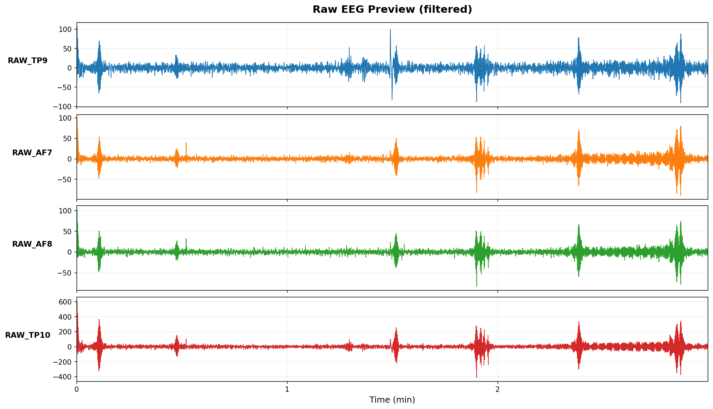
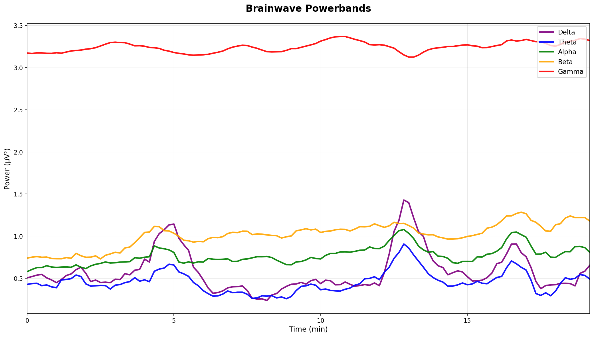
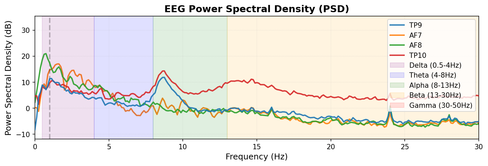
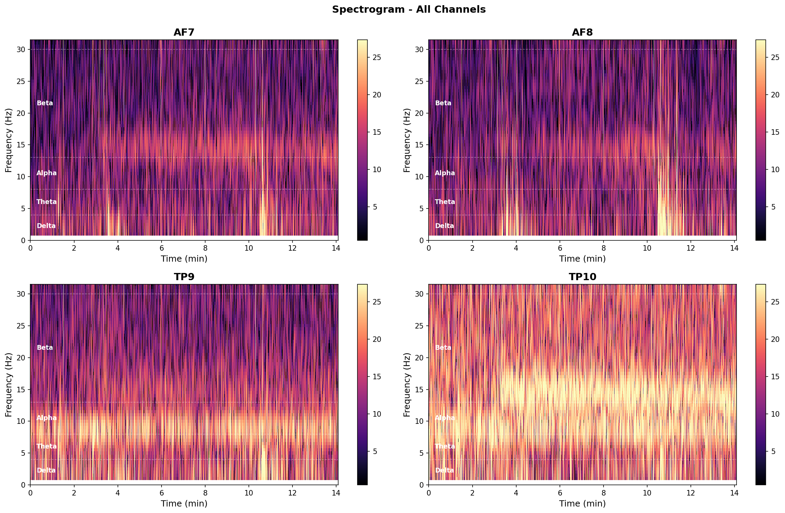
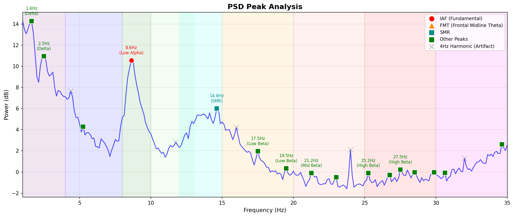
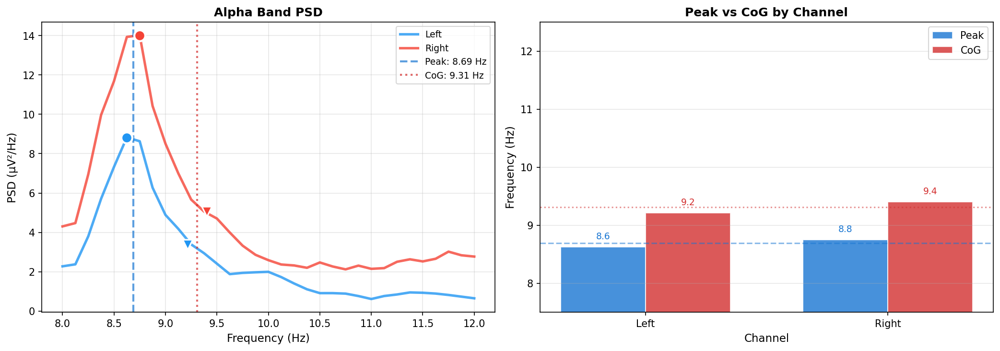
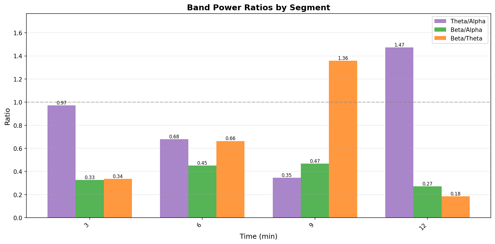
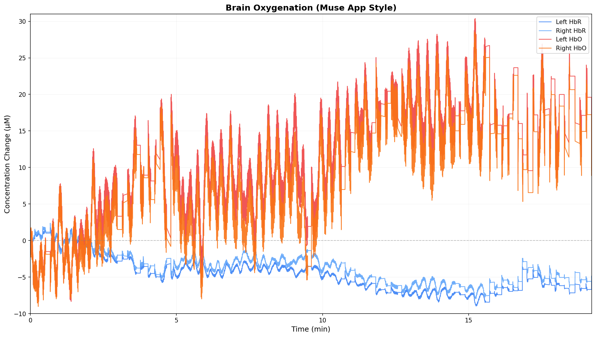
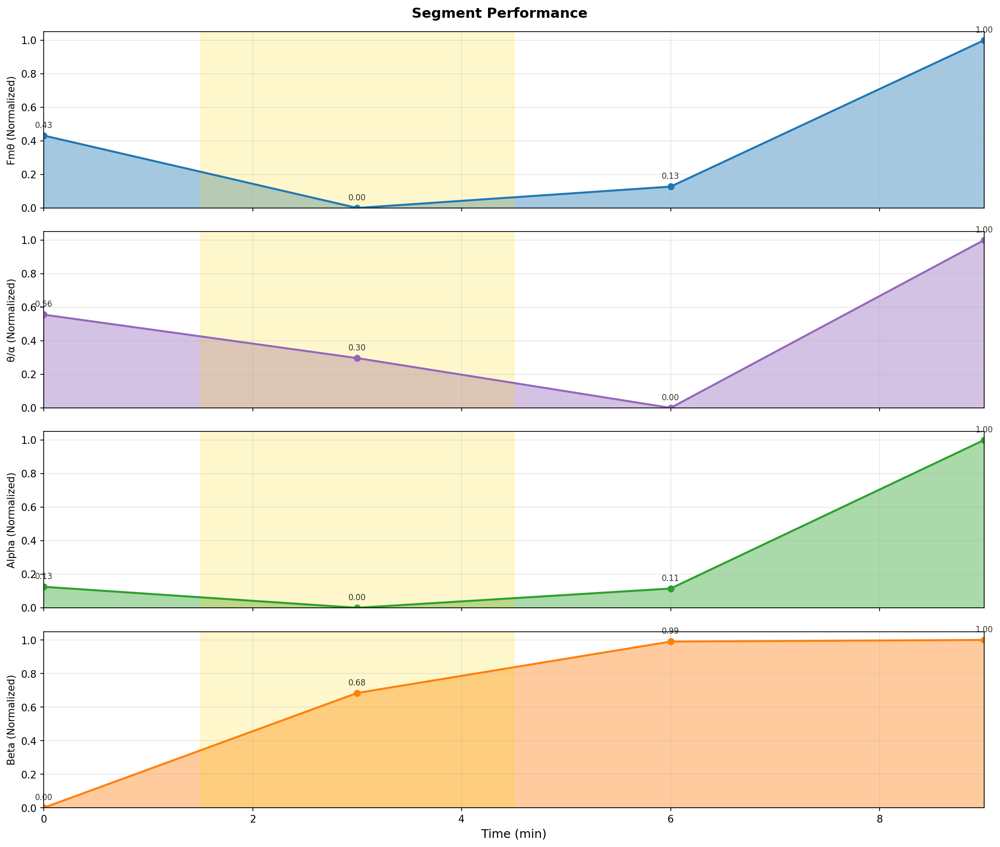

# 瞑想分析レポート
- **生成日時**: 2026-03-06 08:50:39
- **EEGデータ**: `muse_app_2026-03-06--08-05-43.csv`
- **記録時間**: 2026-03-06 08:06:43 ~ 2026-03-06 08:25:56
- **計測時間**: 19.2 分
---

## 🧾 生データプレビュー

> **注**: フィルタ適用後EEGの初期数分（μV表示）。異常波形の早期チェック用。
## 📊 分析サマリー

### 総合評価

- **総合スコア**: 49.0/100

**スコア内訳**

- 瞑想深度 (Fmθ): 0.0/100
- 集中度 (SE): 56.1/100
- 瞑想深度 (θ/α): 85.2/100
- 覚醒度 (β/α): 68.9/100
- 周波数安定性 (IAF): 83.4/100

### 主要指標サマリー

| 指標 | Mean | Best | 単位 |
|:-----|-----:|-----:|:-----|
| Fmθ | 0.816 | 0.202 | dB |
| IAF | 8.688 | 8.750 | Hz |
| Alpha | 5.633 | 5.108 | dB |
| Beta | 1.317 | 1.341 | dB |
| θ/α | 0.867 | 0.680 | ratio |
| HRV | N/A | N/A | ms |

### ピークパフォーマンス

- **最高パフォーマンス区間**: 6
- **スコア**: 31.0/100

## 🧠 周波数帯域分析

### バンドパワー時系列

### パワースペクトル密度（PSD）

### スペクトログラム

### PSDピーク分析

|   周波数 (Hz) |   パワー (dB) | 帯域      | 備考   |
|--------------:|--------------:|:----------|:-------|
|          1.60 |         14.30 | Delta     |        |
|          2.50 |         11.00 | Delta     |        |
|          8.60 |         10.60 | Low Alpha | IAF    |
|         14.60 |          6.00 | SMR       | SMR    |
|         42.80 |          5.10 | Gamma     |        |
|          5.20 |          4.30 | Theta     |        |
|         36.90 |          4.00 | Gamma     |        |
|         38.00 |          3.10 | Gamma     |        |
|         34.60 |          2.60 | Gamma     |        |

> **帯域の説明**:
> - **IAF**: Individual Alpha Frequency（個人のアルファ波ピーク周波数）
> - **FMT**: Frontal Midline Theta（前頭部中心線シータ、4-8Hz）、瞑想深度に関連
> - **SMR**: 感覚運動リズム（12-15Hz）、身体の静止と落ち着きに関連
>
> **注意**: 4Hzの整数倍（4, 8, 12, 16, 20, 24, 28, 32 Hz等）はMuse/Mind Monitor由来の
> アーチファクトの可能性があるため、テーブルから除外しています（グラフではグレーの×印で表示）。
## 🎯 特徴的指標分析

### Individual Alpha Frequency (IAF)

**IAF (Peak)**: 8.69 Hz / **IAF (CoG)**: 9.31 Hz

**チャネル別詳細**

| チャネル   |   Peak (Hz) |   CoG (Hz) |   Power (μV²/Hz) |
|:-----------|------------:|-----------:|-----------------:|
| Left       |        8.62 |       9.21 |             8.83 |
| Right      |        8.75 |       9.40 |            14.02 |

### Alpha Power (Brain Recharge Score)

**Brain Recharge Score**: 76.3 dBx

**Alpha Power**: 7.78 dB

| Metric      |   Value |
|:------------|--------:|
| Score       |   76.33 |
| Alpha Power |    7.78 |
| Score Min   |   62.33 |
| Score Max   |  113.71 |
| Score Std   |    8.33 |

> **解釈**: Brain Recharge ScoreはAlpha波パワーに基づく精神的回復度の指標です。高い値はリラックス・回復状態を示唆します。
> 単位: Score=dBx, Alpha Power=dB

### バンド比率指標

> **指標の解釈**:
> - **θ/α (Theta/Alpha)**: 瞑想深度。値が高いほど深い瞑想状態（内的集中）を示唆
> - **β/α (Beta/Alpha)**: 覚醒度。値が低いほどリラックス状態、高いほど覚醒・緊張状態
> - **β/θ (Beta/Theta)**: 注意・集中度。値が高いほど外的タスクへの集中を示唆

## 🩸 血流動態分析 (fNIRS)

### HbO/HbR時系列

### 統計サマリー

|        |   HbO平均 |   HbO最小 |   HbO最大 |   HbR平均 |   HbR最小 |   HbR最大 |   HbT平均 |   HbD平均 |
|:-------|----------:|----------:|----------:|----------:|----------:|----------:|----------:|----------:|
| 左半球 |     10.66 |     -8.57 |     30.39 |     -4.32 |     -8.97 |      1.78 |      6.34 |     14.99 |
| 右半球 |      8.47 |     -9.03 |     28.51 |     -3.43 |     -7.96 |      2.37 |      5.05 |     11.90 |

> **指標の説明**:
> - **HbO**: 酸素化ヘモグロビン（脳活動で増加）
> - **HbR**: 脱酸素化ヘモグロビン（脳活動で減少）
> - **HbT**: 総ヘモグロビン (HbO + HbR)、総血液量の変化を示す
> - **HbD**: ヘモグロビン差分 (HbO - HbR)、酸素化の程度を示す

### Laterality Index (左右差)

| 指標 | 値 | 解釈 |
|:-----|---:|:-----|
| LI (HbO) | -0.115 | 左半球優位 |
| LI (HbD) | -0.115 | 左半球優位 |

> **LI (Laterality Index)**: LI = (右 - 左) / (右 + 左)。範囲は-1～+1で、正値は右半球優位、負値は左半球優位を示します。

## 🏃 姿勢・体動分析（IMU）

### 時系列詳細（3分ごと）

|   motion_index_mean |   motion_index_max |   gyro_rms |   gyro_rms_corrected |   pitch_rms |   roll_rms |   yaw_rms |
|--------------------:|-------------------:|-----------:|---------------------:|------------:|-----------:|----------:|
|                0.02 |               0.07 |       1.00 |                 0.95 |        0.72 |       0.39 |      0.58 |
|                0.01 |               0.05 |       1.01 |                 0.95 |        0.68 |       0.42 |      0.62 |
|                0.01 |               0.07 |       0.95 |                 0.90 |        0.66 |       0.38 |      0.57 |
|                0.02 |               0.07 |       1.03 |                 0.98 |        0.69 |       0.39 |      0.65 |

## ⏱️ 時間経過分析

### セグメント別パフォーマンス

### バンドパワー詳細

|   min |   δ (dB) |   θ (dB) |   α (dB) |   β (dB) |   γ (dB) |   δ (%) |   θ (%) |   α (%) |   β (%) |   γ (%) |
|------:|---------:|---------:|---------:|---------:|---------:|--------:|--------:|--------:|--------:|--------:|
|  3.00 |    10.57 |     5.01 |     5.14 |     0.28 |    13.04 |   29.20 |    8.12 |    8.36 |    2.73 |   51.58 |
|  6.00 |     7.14 |     3.12 |     4.80 |     1.34 |    10.03 |   23.85 |    9.46 |   13.93 |    6.28 |   46.48 |
|  9.00 |     2.86 |     0.49 |     5.11 |     1.82 |    14.53 |    5.34 |    3.09 |    8.95 |    4.20 |   78.42 |
| 12.00 |    18.32 |     9.17 |     7.49 |     1.83 |    12.76 |   66.43 |    8.08 |    5.49 |    1.49 |   18.50 |

> **注**: min = 経過時間（分）、dB = 絶対パワー、% = 相対パワー（全バンド合計に対する割合）

### 比率と特徴指標

|   min |   θ/α |   β/α |   β/θ |   Fmθ (dB) |   SMR (dB) |   SE |   IAF (Hz) |   ITF (Hz) |   HbO |   HbR |   Yaw RMS | 備考            |
|------:|------:|------:|------:|-----------:|-----------:|-----:|-----------:|-----------:|------:|------:|----------:|:----------------|
|     3 |  0.97 |  0.33 |  0.34 |       0.91 |       3.35 | 0.89 |       8.62 |       5.00 |  0.37 | -0.50 |      0.58 | relaxing        |
|     6 |  0.68 |  0.45 |  0.66 |      -0.10 |       6.10 | 0.94 |       8.75 |       5.00 |  6.64 | -3.45 |      0.62 | peak            |
|     9 |  0.35 |  0.47 |  1.36 |       0.20 |       7.91 | 0.96 |       8.75 |       5.38 |  7.82 | -3.45 |      0.57 |                 |
|    12 |  1.47 |  0.27 |  0.18 |       2.24 |       7.17 | 0.76 |       8.62 |       5.00 | 11.86 | -4.43 |      0.65 | post meditation |

